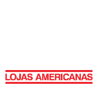

# [Grupo 4] Americanas

<p align="center">
    
</p>

## Sobre
Este repositório é destinado ao armazenamento dos artefatos e atividades do Projeto Americanas, produzido pelo grupo 04 da disciplina de Arquitetura e Desenho de Software e orientado pela Profa. Dra. Milene Serrano durante o semestre 2023.2 da Universidade de Brasília, Campus Gama (UnB/FGA).

## Execução
Você pode acessar a documentação na íntegra [aqui](https://unbarqdsw2023-2.github.io/2023.2_G4_ProjetoAmericanas/#/). A geração do site estático é realizada utilizando o [docsify](https://docsify.js.org/#/).

Se você deseja executar o projeto localmente na sua máquina, certifique-se de haver as dependências necessárias instaladas. Para isso, primeiramente clone o repositório:

```shell
git clone git@github.com:UnBArqDsw2023-2/2023.2_G4_ProjetoAmericanas.git
```

Em seguida, instale as bibliotecas necessárias por meio do seguinte comando:
```shell
npm i docsify-cli -g
```

Por fim, no diretório raiz do repositório, execute o comando:
```shell
docsify init ./docs
```

## Equipe
| Bernardo Pissutti | Bruno Ribeiro | Bruno Bomfim | Gustavo Oliveira | Igor Penha | Lucas Bergholz | Marcos Souza | Paulo Silva | Rafael Rodrigues | Vitor Brito |
|---|---|---|---|---|---|---|---|---|---|
|  |  |  |  |  |  |  |  |  |  |

## Histórico de Versão
|  Versão  | Data da alteração | Alteração | Responsável | Revisor | Data de revisão |
| :---: | :---: | :---: | :---: | :---: | :---: |
| 1.0 | 05/09 | Criação do documento | [Bruno Martins](https://github.com/gitbmvb) | [Lucas Gobbi](https://github.com/LucasBergholz) | 06/09 |
| 1.1 | 02/10 | Adição de ícones, imagens e instruções para execução local | [Bruno Martins](https://github.com/gitbmvb) | [Bruno Ribeiro](https://github.com/BrunoRiibeiro) | 02/10 |