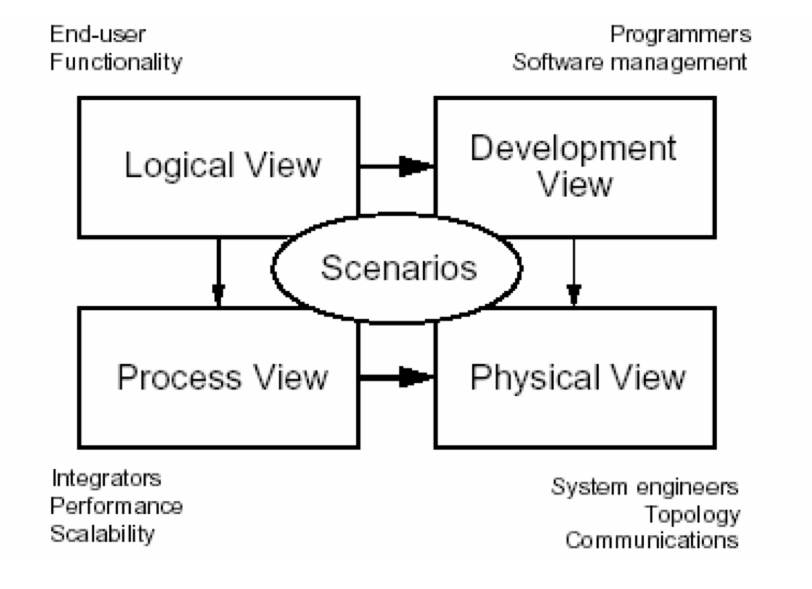
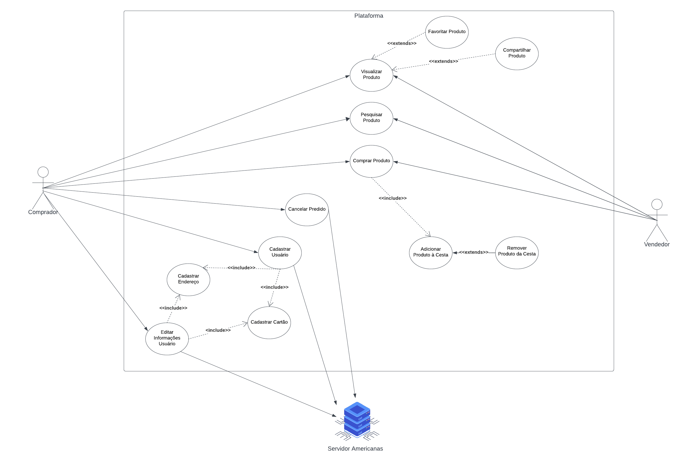
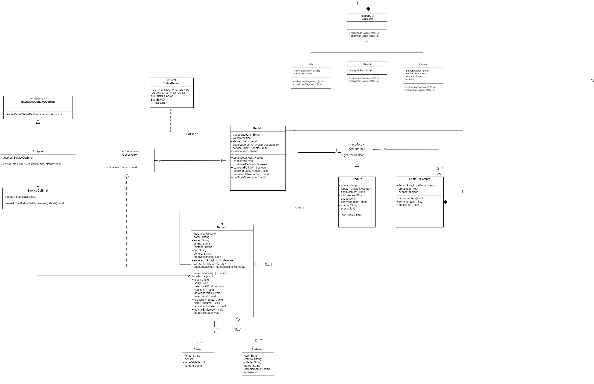
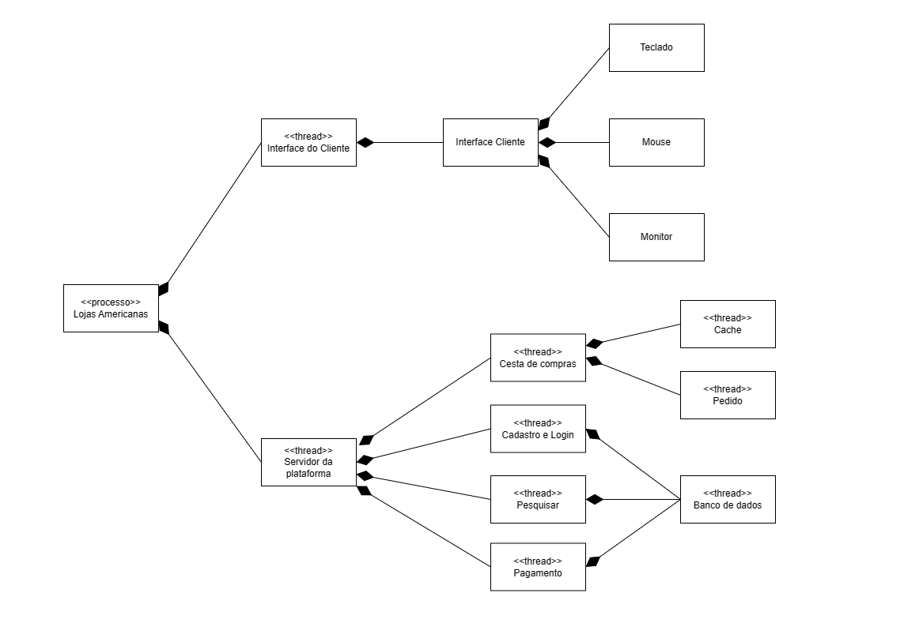

# Documento de arquitetura de software

## 1. Introdução

&emsp;&emsp;No presente documento, analisamos a configuração da arquitetura de software no âmbito do processo de avaliação no contexto do fluxo de perfil comprador do site das Americas, fundamentando nossa abordagem em conceitos adquiridos em ambiente acadêmico. Este texto adota um modelo de arquitetura de software 4 + 1, conforme ilustrado na Figura 1, a fim de proporcionar uma visão abrangente da arquitetura para todos os stakeholders envolvidos. Além disso, tratamos de distintos requisitos, tanto funcionais quanto não-funcionais. O objetivo intrínseco deste Documento de Arquitetura de Software (DAS) consiste em apresentar uma visão abrangente da arquitetura subjacente ao Sistema de Avaliação de Produtos das Americas. Este documento delineia as decisões e diretrizes arquiteturais que foram adotadas com a finalidade de assegurar um design robusto, escalável e de fácil manutenção. Adicionalmente, o DAS desempenha o papel crucial de servir como um ponto de referência para a equipe de desenvolvimento e demais partes interessadas, contribuindo para a consecução da consistência e uma compreensão compartilhada da arquitetura do software.

    <!--  -->

Figura 1 - Modelo de arquitetura de software 4 + 1 Autor: Philippe Kruchten

  

### 1.1 Escopo

&emsp;&emsp;Este Documento de Arquitetura de Software (DAS) abarca a arquitetura inerente ao fluxo de cadastro e compra do site das Americanas. Compreende, de maneira abrangente, a estrutura geral do sistema, suas principais componentes, interfaces, fluxos de informação e as interações entre os diversos módulos do software. A escolha metodológica adotada inicialmente para delinear o escopo do projeto foi a utilização do mapa mental. Nesse contexto, a equipe conduziu uma sessão de brainstorming, objetivando identificar e listar os diferentes aspectos relacionados ao sistema em desenvolvimento. Durante essa atividade, os membros da equipe contribuíram com suas perspectivas e conhecimentos, enriquecendo o mapa mental com elementos relevantes. A versão final do mapa mental encontra-se apresentada a seguir.

&emsp;&emsp;Como resultado da execução da técnica, obtivemos o artefato apresentado abaixo, que apresenta todas as ideias coletadas e priorizadas durante a realização do Brainstorming na ferramenta <a href="https://miro.com">Miro</a>.

 
<iframe width="768" height="432" src="https://miro.com/app/live-embed/uXjVMmMS6TU=/?moveToViewport=-3770,-1392,7485,3479&embedId=754196101178" frameborder="0" scrolling="no" allow="fullscreen; clipboard-read; clipboard-write" allowfullscreen></iframe>

Figura 2 - Brainstorm no Miro

 

## 2. Representação arquitetural

### 2.1 Diagrama de classes

&emsp;&emsp;O <b>diagrama de classes</b> oferece uma representação visual das classes em um sistema de software, destacando suas propriedades, métodos e as relações entre elas. Ele é fundamental na fase de design de software, fornecendo uma visão clara e abstrata da estrutura do sistema, servindo como base para o desenvolvimento e implementação.

- _Consulte o [diagrama de classes](https://unbarqdsw2023-2.github.io/2023.2_G4_ProjetoAmericanas/#/Modelagem/Estaticos/classes.md) do **Projeto Americanas**._

### 2.2 Diagrama de pacotes

&emsp;&emsp;O diagrama de pacotes visa organizar e estruturar um sistema de software em módulos ou pacotes, no qual cada pacote agrupa elementos relacionados, como classes, interfaces ou outros pacotes, proporcionando uma visão hierárquica da arquitetura do sistema. O diagrama de pacotes é valioso para entender a organização global do sistema, identificar dependências entre componentes e facilitar a manutenção e evolução do software, uma vez que proporciona uma visão clara das interações entre os diferentes módulos que compõem a aplicação.

- _Consulte o [diagrama de pacotes](https://unbarqdsw2023-2.github.io/2023.2_G4_ProjetoAmericanas/#/Modelagem/Estaticos/pacotes.md) do **Projeto Americanas**._

### 2.3 Diagrama de estados

&emsp;&emsp;O diagrama de estados é uma representação visual que descreve o comportamento dinâmico de um objeto ou sistema ao longo do tempo. Ele foca nos diferentes estados que um objeto pode assumir e nas transições entre esses estados em resposta a eventos específicos. Ele é valioso no design de software para compreender e visualizar as possíveis sequências de eventos que afetam o comportamento de um sistema, facilitando a identificação de casos de uso e contribuindo para a implementação robusta e eficiente de sistemas dinâmicos.

- _Consulte o [diagrama de estados](https://unbarqdsw2023-2.github.io/2023.2_G4_ProjetoAmericanas/#/Modelagem/Dinamicos/estados.md) do **Projeto Americanas**._

### 2.4 Diagrama de comunicação

&emsp;&emsp;O diagrama de comunicação (ou colaboração) é uma representação visual que destaca as interações entre objetos em um sistema, focando nas mensagens trocadas entre os objetos e nos relacionamentos dinâmicos que ocorrem durante a execução do sistema. Ele é importante para entender as dinâmicas do sistema e é utilizado na fase de design para visualizar e comunicar as interações entre objetos, contribuindo para um desenvolvimento de software mais claro e eficiente.

- _Consulte o [diagrama de comunicação](https://unbarqdsw2023-2.github.io/2023.2_G4_ProjetoAmericanas/#/Modelagem/Dinamicos/comunicacao.md) do **Projeto Americanas**._

### 2.5 Diagrama de Componentes

&emsp;&emsp;O diagrama de componentes é uma representação visual que oferece uma visão detalhada da estrutura física de um sistema de software, destacando os diferentes componentes do sistema, como bibliotecas, executáveis, arquivos ou módulos, e as relações entre eles. O diagrama de componentes é crucial para compreender a implementação real do software, ajudando na visualização da arquitetura física, na identificação de pontos de integração e na distribuição dos elementos no ambiente de execução.

- _Consulte o [diagrama de componentes](https://unbarqdsw2023-2.github.io/2023.2_G4_ProjetoAmericanas/#/Modelagem/Estaticos/componentes.md) do **Projeto Americanas**._

## 3. Objetivos e restrições arquiteturais

- Escalabilidade - O objetivo é construir uma arquitetura flexível que atenda aos requisitos atuais do projeto e que, ao mesmo tempo, possa aumentar no futuro. Ao projetar um produto escalável, portanto, a empresa será capaz de atender às necessidades do seu mercado de forma rápida e fácil. A escalabilidade do software permite que os negócios permaneçam estáveis e produtivos, apesar das volatilidades de cada setor, e traz benefícios também no longo prazo, com menores gastos de manutenção, maior agilidade e custos de atualização mais baratos.
   
- Segurança: O sistema deve incorporar medidas robustas de segurança para proteger dados sensíveis, prevenir acesso não autorizado e garantir a confidencialidade e integridade das informações. Implementar práticas de criptografia, autenticação e autorização para fortalecer as defesas contra potenciais ameaças.
   
- Integridade - O software deve manter como precisão e consistência os dados armazenados, validando a entrada de dados e certificando a integridade referencial dos mesmos, fazendo com que as relações entre os diferentes conjuntos de dados não sejam perdidas. Desenvolver estratégias para recuperar e restaurar dados em caso de falhas ou perdas.
   
- Disponibilidade: Garantir que o sistema esteja disponível de maneira consistente, minimizando tempos de inatividade. Implementar estratégias de redundância, backups regulares e monitoramento para lidar eficientemente com falhas e garantir a continuidade operacional.
   
- Confiabilidade - deve haver confiabilidade do software para proteger a privacidade e os dados dos usuários, evitar falhas técnicas e prevenir ameaças cibernéticas.
   
- Restrições de Desempenho: Estabelecer parâmetros claros para o desempenho do sistema, considerando carga máxima, tempos de resposta e eficiência geral. Definir metas de desempenho e otimizar a arquitetura para atender a essas expectativas, assegurando uma experiência do usuário fluida e eficiente.
   
- Restrições de interoperabilidade: Especificar como o sistema deve interagir com outros sistemas externos ou legados, incluindo protocolos de comunicação, formatos de dados, etc.

## 4. Visão de Casos de Uso
Esta visão possui papel imprescindível em entender os casos de uso do sistema, em termos arquiteturais e em requisitos não funcionais. Dessa forma, tal visão permite visualizar e comunicar de maneira clara como o sistema atende as necessidades do usuário. [1]

### 4.1 Casos de Uso
O primeiro passo para a realização com sucesso dessa visão é o desenvolvimento de uma lista de casos de uso do sistema, afim de posteriormente criar o diagrama de casos de uso. Para isso, foi realizada uma reunião entre os membros Lucas Gobbi e Bruno Martins onde os mesmos produziram esta tabela. [1]

### 4.2 Tabelas de Casos de Uso
#### Atores
| ID | Ator | Descrição |
| --- | ---- | --------- |
| 1 | Comprador  | Usuário comprador de produtos |
| 2 |  Vendedor  | Usuário vendedor de produtos  |
| 3 | Servidor   | Servidor dos sites da Americanas |

Tabela 1 - Tabela de Atores (GOBBI, Lucas. MARTINS, Bruno. 2023)

#### Casos de Uso
| ID  | Descrição |
| --- | --------- |
| CDU01 | Comprar Produto    |
| CDU02 | Visualizar Produto |
| CDU03 | Pesquisar Produto  |
| CDU04 | Cadastrar Usuário  |
| CDU05 | Cadastrar Endereço |
| CDU06 | Cadastrar Cartão   |
| CDU07 | Adicionar Produto à Cesta |
| CDU08 | Cancelar Pedido    |
| CDU09 | Favoritar Produto   |
| CDU10 | Compartilhar Produto |
| CDU11 | Editar Informações Usuário |
| CDU12 | Remover Produto da Cesta |

Tabela 2 - Tabela de Casos de Uso (GOBBI, Lucas. MARTINS, Bruno. 2023)

### 4.3 Diagramas de Casos de Uso

Figura 3 - Diagrama UML da Visão dos Casos de Uso (GOBBI, Lucas. MARTINS, Bruno. 2023)

### 4.4 Reunião
Assista à gravação na íntegra:

<iframe width="560" height="315" src="https://www.youtube.com/embed/TFxtp0JNA6k?si=7BbSrjHIjZC95J2x" title="YouTube video player" frameborder="0" allow="accelerometer; autoplay; clipboard-write; encrypted-media; gyroscope; picture-in-picture; web-share" allowfullscreen></iframe>

Caso não consiga visualizar o vídeo, acesse o link: [https://youtu.be/TFxtp0JNA6k](https://youtu.be/TFxtp0JNA6k)

## 5. Visão lógica

### 5.1 Visão Geral

&emsp;&emsp;Fornecer uma base para compreender a estrutura e a organização do design do sistema.

### 5.2 Pacotes de design arquitetonicamente significativos

#### Diagrama de Pacotes

* _Consulte o [diagrama de pacotes](../Modelagem/Estaticos/pacotes.md) do **Projeto Americanas**._

    

Figura 4 - Diagrama de Pacotes Autor: autoria propria

  

&emsp;&emsp;O diagrama de pacotes considera duas partes principais do sistema: o frontend e o backend, cada um desempenhando funções específicas para o funcionamento eficaz da aplicação.

&emsp;&emsp;O <b>frontend</b> é a face visível da aplicação, responsável por carregar e exibir a interface na tela do usuário. Sua arquitetura é componentizada, promovendo a modularidade e facilitando o reúso de código. Essa abordagem não apenas agiliza o desenvolvimento, mas também facilita futuras atualizações e manutenções. Além disso, o frontend integra-se com o backend por meio de requisições bem definidas, proporcionando uma experiência do usuário fluida e responsiva.

&emsp;&emsp;Por outro lado, o <b>backend</b>, representado pela API, implementa as regras de negócio e as gerenciadas, garantindo o processamento das operações da aplicação. Além disso, o backend estabelece a conexão com o banco de dados, garantindo a persistência e recuperação de dados. 

#### Diagrama de Classes

* _Consulte o [diagrama de classes](../Modelagem/Estaticos/classes.md) do **Projeto Americanas**._

    

Figura 5 - Diagrama de Classes Autor: autoria própria

  

1. **Foco no fluxo do usuário até a compra:**
   - Uma abordagem centrada na experiência do usuário, buscando entender e otimizar o caminho que os usuários percorrem até efetuar uma compra.

2. **Utilização de enums para modelagem precisa de atributos:**
   - Uma abordagem para garantir precisão na representação dos atributos dos produtos, proporcionando uma maneira mais controlada e específica de lidar com esses dados.

### Diagrama de Classes com representação dos Padrões

Figura 5.1 - Diagrama de Classes com padrões de projeto Autor: autoria própria

  

## 6. Visão de processo

A visão de processo se concentra nas atividades dinâmicas do sistema, mostrando como diferentes processos (ou threads) interagem e cooperam para atender aos requisitos funcionais e não funcionais do sistema. 
Essa visão ajuda a entender como as operações ocorrem ao longo do tempo, identificando concorrência e cooperação entre os diferentes elementos do sistema.

Na imagem abaixo esta representado um Diagrama de Classes que focou no detalhamento dos processos que ocorrem durante o uso da plataforma Lojas Americanas. O diagrama foi feito levando em consideração o documento de [Diagrama de Classes](../Modelagem/Estaticos/classes.md), onde as classes do sistema foram descritas, porém no diagrama a seguir as classes foram representadas juntas com os processos. Além disso, esta descrito na imagem como essas threads interagem umas com as outras para realizar as funcionalidades do sistema.

Figura 6: Diagrama de Classes com detalhamento dos processos Autor: autoria própria

  

Explicando um pouco do diagrama acima, podemos ver que a Lojas Americanas esta sendo particionada em dois processos, a "Interface do Cliente" que é basicamente os objetos com os quais o usuário tem contato, como o teclado, monitor e mouse, e temos o "Servidor da plataforma", no qual estão contidos os processos ou threads de "Cesta de compras", "Cadastro e Login", "Pesquisar" e "Pagamento". Perceba que todos são processos que dependem do usuário para serem iniciados, porém são executados pelo servidor da plataforma.

## 7. Visão de implementação

&emsp;&emsp;A visão de implementação representa a disposição estática dos módulos de software, abrangendo elementos como código-fonte, arquivos de dados, executáveis e documentação, dentro do contexto do ambiente de desenvolvimento. Essa perspectiva é abordada mediante:

- **Organização em Embalagens e Camadas:**
  Refere-se à estruturação dos componentes de software em agrupamentos lógicos, frequentemente organizados em embalagens e camadas. Essa abordagem proporciona uma hierarquia discernível, facilitando a compreensão das interações entre os diversos módulos. Além disso, promove a modularidade do sistema, facilitando a manutenção e evolução do software.

- **Gestão de Configuração:**
  Envolvendo propriedades e estratégias de liberação, a gestão de configuração desempenha um papel crucial na manutenção da consistência e rastreabilidade do ambiente de desenvolvimento. Isso inclui o controle de versões, a documentação adequada das alterações realizadas e a definição de estratégias eficazes de liberação. Tais práticas visam garantir a estabilidade e uma evolução controlada do software.

&emsp;&emsp;Neste contexto, é fundamental destacar que a visão de implementação está intrinsicamente associada à tradução da visão lógica do sistema, incluindo suas entidades e relações, para componentes de software tangíveis. Esta tradução não apenas delineia a estrutura estática do sistema, mas também fornece insights cruciais sobre a organização interna, permitindo uma compreensão mais profunda da implementação efetiva do software.

### 7.1. Visão geral

&emsp;&emsp;Para a elaboração deste artefato, optamos por empregar o <a href="https://unbarqdsw2023-2.github.io/2023.2_G4_ProjetoAmericanas/#/Modelagem/Estaticos/componentes">diagrama de componentes</a> previamente concebido pelo grupo, o qual se fundamentou no artefato de <a href="https://unbarqdsw2023-2.github.io/2023.2_G4_ProjetoAmericanas/#/Base/richPicture">Rich Picture</a>. Procedemos, contudo, a devidas correções a fim de aprimorar a representação do fluxo e conferir uma visão mais precisa da implementação do sistema.

&emsp;&emsp;A escolha por reutilizar o referido diagrama se justifica pela conveniência em preservar a coerência conceitual e a continuidade na representação gráfica, alinhada com as etapas anteriores do processo de modelagem, também sendo a modelagem de diagramas de principal indicação, segundo os materiais de estudo da professora Milene Serrano, para a realização da visão de implementação. Dessa forma, procuramos mitigar possíveis discrepâncias e assegurar uma transição fluida entre os artefatos.

### 7.2. Diagrama de componentes

  
  <h4> Figura 7: Diagrama de Componentes versão 2</h4>
  
 Fonte: Autoria própria 

  
 Autor: Bruno Ribeiro, Igor Penha e Marcos Felipe, 2023 

## 8. Visão de Dados

A Visão de Dados é uma dimensão crucial na arquitetura de software, mostrando a estrutura fundamental que sustenta as operações de um sistema. No contexto deste documento, exploraremos a Modelo Entidade-Relacionamento (ME-R), um paradigma robusto para representar e organizar dados. O ME-R serve como a espinha dorsal para definir e compreender as interações entre diferentes entidades em um sistema. O Diagrama Entidade-Relacionamento (DE-R) é uma ferramenta para visualizar e compreender a complexidade das relações entre entidades.

### 8.1. Modelo Entidade-Relacionamento (ME-R)

#### Entidades

- Usuario
- Pedido
- Produto
- Pagamento
- Endereco
- Cartao

### Descrição das Entidades

- Usuario: idUsuario, nome, email, senha, telefone, dataNascimento, genero
- Pedido: idPedido, transportadora, valor, status
- Produto: idProduto, nome, avaliacao, marca, qtdEstoque
- Pagamento: idPagamento, parcelas, formaPagamento
- Endereco: idEndereco, numero, complemento, bairro, cidade, estado, cep
  Cartao: idCartao, nome, cvv, dataValidade, numero

### Descrição dos relacionamentos

**Usuário contém Cartão**

- Um Usuário pode possuir nenhum ou vários cartões (1,n). Um cartão pode ser contido por no mínimo um usuário e no máximo um (1,1);

**Usuário contém Endereço**

- Um usuário pode conter nenhum ou vários endereços (0,n). Um endereço pode ser contido por no mínimo um usuário, e no máximo um.

**Usuário possui Pedido**

- Um Usuário pode possuir nenhum ou vários pedido(0,n). Um Pedido pode ser possuido por no minimo um Usuário, e no máximo um (1,1);

**Pedido possui Pagamento**

- Um Pedido pode possuir no mínimo um pagamento, e no máximo um (1,1). Um pagamento pode ser possuido por no mínimo um pedido, e no máximo um (1,1);

**Pedido possui Produto**

- Um pedido possui no minimo um Produto ou vários Produtos (1,n). Um Produto pode ser possuido por nenhum ou vários pedidos (0,n).

### 8.2. Diagrama Entidade-Relacionamento (DE-R)

 Figura 8: Diagrama Entidade-Relacionamento (Elaborado por: Vitor Manoel & Gustavo Barbosa. 2023).

### 8.3 Reunião

Assista à gravação na íntegra:

<iframe width="560" height="315" src="https://www.youtube.com/embed/SpQ589IcQ1E?si=PUS1PJFt5r882hZi" title="YouTube video player" frameborder="0" allow="accelerometer; autoplay; clipboard-write; encrypted-media; gyroscope; picture-in-picture; web-share" allowfullscreen></iframe>

Caso não consiga visualizar o vídeo, acesse o link: [https://www.youtube.com/embed/SpQ589IcQ1E?si=PUS1PJFt5r882hZi](https://youtu.be/TFxtp0JNA6k)

## 9. Tamanho e performance

&emsp;&emsp;Ao adotar a estrutura modular do ReactJS para o frontend e integrar Vite como ferramenta de desenvolvimento proporcionam uma divisão eficiente de componentes. Criar módulos independentes e reutilizáveis não apenas facilita a manutenção, mas também contribui para um tamanho total reduzido, promovendo a eficiência no carregamento. Além disso o uso do Redux para o genrenciamento de estados, permite um controle mais eficaz do estado da aplicação, prevenindo redundâncias e melhorando o desempenho global.

&emsp;&emsp;Considerando a necessidade de tornar a aplicação portável, a utilização do Docker torna-se fundamental para assegurar seu funcionamento em ambientes diversos, apesar do treadeoff de performancex. Diante disso, surge a preocupação em otimizar a imagem da aplicação, evitando criar imagens excessivamente grandes. Um exemplo prático é a conteinerização do frontend, que, em média, consome cerca de 1 GB de espaço. Essa  considerável demanda de espaço é comum devido à natureza pesada das aplicações frontend. Para aprimorar a eficiência do projeto, é essencial buscar estratégias que reduzam esse impacto, garantindo uma utilização mais eficaz dos recursos..

## 10. Qualidade

&emsp;&emsp;A consideração dos critérios de qualidade de software no contexto do portal das Americanas é imperativa, destacando-se a relevância da escalabilidade, elasticidade e outros atributos pertinentes. A eficácia da expansibilidade torna-se essencial para gerir o fluxo intricado de cadastro, compra e pagamento, visando proporcionar uma experiência contínua e satisfatória aos usuários. A escalabilidade de dados desempenha um papel preponderante na habilidade do sistema em lidar com o acréscimo volumétrico de informações, notadamente nas transações frequentes e detalhes dos clientes inerentes ao âmbito das Americanas. Assegurar um armazenamento eficiente, processamento ágil e uma distribuição de carga adequadamente delineada constitui premissa fundamental para preservar o desempenho ótimo do sistema.

&emsp;&emsp;No escopo da escalabilidade horizontal, faz-se fulcral que as Americanas contem com serviços que propiciem a expansão da capacidade de armazenamento conforme necessidade. Soluções exemplificadas pelo AWS Amazon S3 podem conferir uma abordagem escalável e sustentável, alinhada aos benefícios previamente mencionados, tais como redução do consumo energético e uso judicioso dos recursos naturais. A escalabilidade vertical também desempenha papel de significância, particularmente no fluxo de pagamento, onde a volatilidade da demanda é uma constante. A habilidade do sistema em prover recursos adicionais, como unidades de processamento central (CPU) e memória de acesso aleatório (RAM), para lidar com momentos de carga intensa é imperativa. Em ambientes de nuvem, tal escalabilidade pode ostentar uma dinâmica inerente e, eventualmente, automatizada, visando atender às demandas emergentes de maneira expedita.

&emsp;&emsp;A escalabilidade de rede é crucial para garantir que a infraestrutura das Americanas possa lidar eficientemente com picos de demanda e tráfego. Soluções como o Elastic Load Balancing da AWS otimizam a distribuição de tráfego, melhorando a escalabilidade do sistema. A elasticidade, a capacidade de dimensionar variavelmente conforme as demandas, é essencial para gerenciar picos de acesso ao portal. Serviços como o AWS Amazon S3 e alternativas de nuvem, como Microsoft Azure e Google Cloud Platform, oferecem escalabilidade dinâmica, garantindo estabilidade operacional em períodos de intensa demanda. A automação dessa escalabilidade, adaptando-se proativamente a padrões de uso, é um diferencial crucial em ambientes de nuvem.

&emsp;&emsp;Quanto aos critérios de qualidade ISO/IEC 25010, diversos aspectos podem ser aplicados ao portal das Americanas. A extensibilidade, exemplificada pela adoção de padrões de projeto e a reutilização de código, viabiliza uma adaptação expedita para acomodar novos requisitos futuros. A portabilidade revela-se essencial, considerando a necessidade de o sistema ajustar-se fluidamente a distintos sistemas operacionais e arquiteturas, assegurando uma experiência homogênea para os usuários. No tocante à segurança, é de primordial importância que o portal das Americanas assegure a confidencialidade, autenticidade e integridade dos dados dos usuários, em estrita consonância com a Lei Geral de Proteção de Dados Pessoais (LGPD). A manutenabilidade, por sua vez, pode ser preservada por meio de uma estrutura modular, reduzindo as interdependências entre diversas camadas do sistema, conforme ilustrado pelo Diagrama de Pacotes.

## 11 Referências
- [1] SERRANO, Milene. Slides de aula. Disponível em: [aqui](https://aprender3.unb.br/pluginfile.php/2649469/mod_label/intro/Arquitetura%20e%20Desenho%20de%20Software%20-%20Aula%20Arquitetura%20e%20DAS%20-%20Parte%20II%20-%20Profa.%20Milene.pdf)
- [2] Artefato DAS Grupo 2, Mercado Livre. 2023. Disponível em: [aqui](https://unbarqdsw2023-1.github.io/2023.1_G2_ProjetoMercadoLivre/#/ArquiteturaReutilizacao/4.1.1.DAS)

> * Centro de Informática, Universidade Federal de Pernambuco. Título do conteúdo. Disponível em: https://www.cin.ufpe.br/~gta/rup-vc/core.base_rup/guidances/concepts/logical_view_C135365E.html. Acesso em: 30 de novembro de 2023.

## 12. Histórico de versão

|  Versão  |   Data da alteração  |   Alteração  |  Responsável  |  Revisor  | Data de revisão |
| :------: | :------------------: | :-----------: | :--------------: | :--------: | :-----------------: |
| `1.0` | 29/11/2023 | Criação do modelo do artefato | [Bruno Ribeiro](https://github.com/BrunoRiibeiro) e [Igor Penha](https://github.com/igorpenhaa) | [Lucas Bergholz](https://github.com/LucasBergholz) | 29/11/2023 |
| `1.1` | 29/11/2023 | Add textos intrudoção. | [Bruno Ribeiro](https://github.com/BrunoRiibeiro) e [Igor Penha](https://github.com/igorpenhaa) | [Lucas Bergholz](https://github.com/LucasBergholz) | 29/11/2023 |
| `1.2` | 29/11/2023 | Add textos de qualidade. | [Bruno Ribeiro](https://github.com/BrunoRiibeiro) e [Igor Penha](https://github.com/igorpenhaa) | [Lucas Bergholz](https://github.com/LucasBergholz) | 29/11/2023 |
| `1.3` | 29/11/2023 | Add tópico 2: Representação arquitetural. | [Bruno Martins](https://github.com/gitbmvb) e [Lucas Bergholz](https://github.com/LucasBergholz) | [Bruno Ribeiro](https://github.com/BrunoRiibeiro) | 29/11/2023 |
| `1.4` | 30/11/2023 | Add visão de implementação | [Bruno Ribeiro](https://github.com/BrunoRiibeiro) e [Igor Penha](https://github.com/igorpenhaa) | [Bruno Martins](https://github.com/gitbmvb) | 30/11/2023 |
| `1.5` | 30/11/2023 | Add visão de casos de uso | [Bruno Martins](https://github.com/gitbmvb) e [Lucas Bergholz](https://github.com/LucasBergholz) | [Bruno Ribeiro](https://github.com/BrunoRiibeiro) | 30/11/2023 |
| `1.6` | 30/11/2023 | Adição tamanho e performance | [Bernardo Pissutti](https://github.com/berssutti) e [Paulo Henrique](https://github.com/owhenrique) | [Lucas Bergholz](https://github.com/LucasBergholz) | 30/11/2023 |
| `1.7` | 30/11/2023 | Adiciona visão logica | [Bernardo Pissutti](https://github.com/berssutti) | [Lucas Bergholz](https://github.com/LucasBergholz) | 30/11/2023 |
| `1.8` | 30/11/2023 | Add objetivos e restrições arquiteturais / visão de dados | [Vitor Manoel](https://github.com/vitormanoel17) e [Gustavo Barbosa](https://github.com/brbsg) | [Bernardo Pissutti](https://github.com/berssutti) | 30/11/2023 |
| `1.9` | 30/11/2023 | Add tópico 6: Visão de Processo. | [Rafael Bosi](https://github.com/StrangeUnit28) | [Lucas Bergholz](https://github.com/LucasBergholz) | 30/11/2023 |
| `2.0` | 01/12/2023 | Add UML com padrões e gravação visão de dados | [Vitor Manoel](https://github.com/vitormanoel17) | [Lucas Bergholz](https://github.com/LucasBergholz) | 01/12/2023 |

