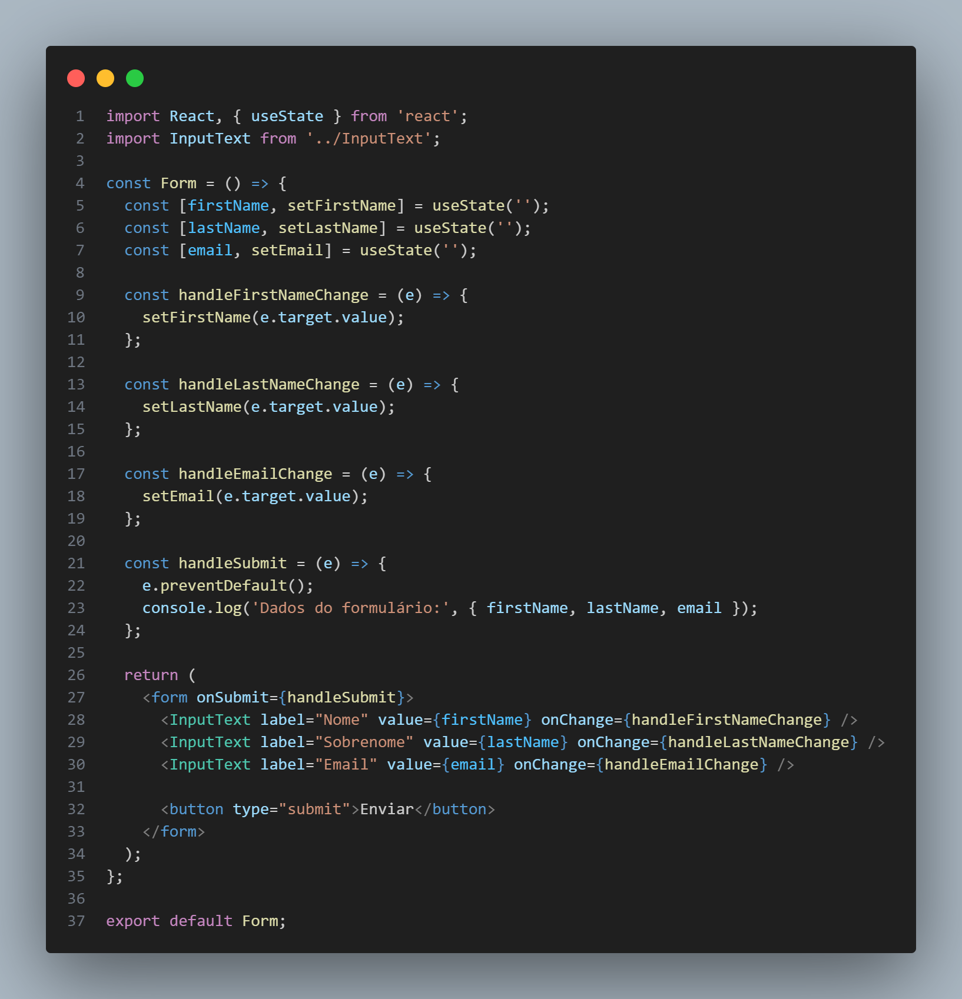

# 4.2. Módulo Reutilização de Software

## Introdução

&emsp;&emsp;Na maioria dos projetos de software, há algum reúso de software. Isso acontece muitas vezes informalmente,
quando as pessoas envolvidas no projeto sabem de projetos ou códigos semelhantes ao que é exigido. Elas os
buscam, fazem as modificações necessárias e incorporam-nos a seus sistemas. Apesar de o reúso ter sido proposto como uma
estratégia de desenvolvimento há mais de 40 anos (McILROY, 1968), só em 2000 o ‘desenvolvimento com reúso’ se tornou
a norma para novos sistemas de negócios. A mudança para o desenvolvimento baseado em reúso foi uma resposta às
exigências de menores custos de produção e manutenção de software, entregas mais rápidas de sistemas e softwares de
maior qualidade. Cada vez mais empresas consideram o software como um ativo valioso. O reúso tem sido promovido
para aumentar o retorno sobre os investimentos em software.(Sommerville, Ian. 2011) Exemplos de unidade de software reutilizaveis:

1. **Reúso de sistema de aplicação.** A totalidade de um sistema de aplicação pode ser reusada sem alterações em outros
sistemas ou pela configuração da aplicação para diferentes clientes. Como alternativa, podem ser desenvolvidas
297Capítulo 16 Reúso de software
famílias de aplicações com uma arquitetura comum, mas adaptadas para clientes específicos. Ainda neste capítulo,
eu trato do reúso de sistemas de aplicação.
2. **Reúso de componentes.** Os componentes de uma aplicação, variando em tamanho desde subsistemas até objetos
únicos, podem ser reusados. Por exemplo, um sistema de identificação de padrões desenvolvido como parte de
um sistema de processamento de textos pode ser reusado em um sistema de gerenciamento de banco de dados.
Trato de reúso de componentes nos capítulos 17 e 19.
3. **Reúso de objetos e funções.** Componentes de software que implementam uma única função, como uma função
matemática ou uma classe de objeto, podem ser reusados. Essa forma de reúso, baseada em bibliotecas-padrão,
tem sido comum nos últimos 40 anos. Muitas bibliotecas de funções e classes estão disponíveis gratuitamente.
Você reusa as classes e funções nessas bibliotecas, ligando-as com o código da aplicação recém-desenvolvido. Essa
é uma abordagem particularmente eficaz em áreas como algoritmos e gráficos matemáticos, em que o conheci-
mento especializado é necessário para o desenvolvimento de funções e objetos eficientes

## Objetivo

&emsp;&emsp; O objetivo do artefato em questão é propor um design arquitetural focado em reuso de código e componentes para a aplicação das Lojas Americanas, levando em consideração conceitos e tecnologias que podem ser utilizadas para tal. 

## Metodologia

&emsp;&emsp; As propostas de projeto, design e tecnologias sustentadas nesse artefato foram discutidas e pensadas em grupo e visando entender melhor e aplicar os aos conceitos apresentados nas aulas de arquitetura e reuso de software.

## Desenvolvimento

### Reuso de Conceito

Os componentes e os sistemas de software são entidades potencialmente reusáveis, mas, algumas vezes, sua natureza
específica significa que é caro modificá-los para uma nova situação. Uma forma complementar de reúso é o ‘reúso
de conceito’, em que, em vez de reusar um componente de software, você reusa uma ideia, uma forma, um trabalho ou
um algoritmo. Pode, portanto, ser configurado e adaptado para uma série de situações. O conceito de
reúso pode ser incorporado em abordagens como **padrões de projeto**, que é a forma que reuso que foi desendolvida nessa seção.(Sommerville, Ian. 2011)

#### Pedido - Observer/Adapter

#### Pagamento - <padrão utilizado>

#### Usuario - <padrão utilizado>

#### Cesta/Produto - <padrão utilizado>

### Reuso Externo

&emsp;&emsp;Muitas técnicas e ferramentas foram desenvolvidas para oferecer suporte a implementações centradas no reúso de software. Essas abordagens concentram-se em aplicações que compartilham sistemas ou domínios de aplicação, buscando semelhanças e potencial de reúso. O conceito de reúso é amplo, e, no contexto do software, pode se manifestar em implementações desde funções simples, que encapsulam códigos usados em várias partes de uma aplicação, até fluxos complexos com utilidade em poucos locais, mas que necessitam manter consistência em seu funcionamento, justificando assim sua associação.

### Frameworks

&emsp;&emsp;Frameworks podem ser descritos como software para desenvolvimento de softwares. Um software que melhor suporta um processo de desenvolvimento orientado a objetos por meio das abstrações de alta granularidade, simplificando, um conjunto de classes, objetos e componentes que nós oferecem ferramentas que auxiliam no desenvolvimento de software.

&emsp;&emsp;Existem vários tipos de frameworks, cada um deles focado em algum ponto no desenvolvimento de software.No quesito reúso de projeto, frameworks podem auxiliar na reutilização de classes no sistema, podendo ser utilizado herança, classes abstradas entre outras ferramentas de implementação.

#### Vite
#### ReactJs

&emsp;&emsp;
O React.js é tecnicamente uma biblioteca, mas para muitos, é considerado um framework para o desenvolvimento web com JavaScript. O React.js oferece uma ampla gama de ferramentas que tornam o desenvolvimento e a reutilização de código mais acessíveis. Em vez de nos concentrarmos em um framework específico, vamos explorar algumas das opções que esta biblioteca nos oferece para criar códigos front-end de forma fácil e reutilizável.

Todo o desenvolvimento de componentes, que são a base do React.js, nos permite criar códigos de menor escala para serem utilizados em várias páginas diferentes. Um bom exemplo disso pode ser observado na criação de formulários, onde cada formulário possui campos para inserção de valores e um botão para enviar essas informações.

&emsp;&emsp;O componente de input é utilizado múltiplas vezes nesse formulário e poderia ser aproveitado em componentes ou páginas sem relação direta com formulários. Este é apenas um pequeno exemplo das possibilidades de reutilização oferecidas pelos componentes no React.js 

### Ferramentas

## Resultado e conclusões

&emsp;&emsp;Discorrer e analisar as conclusões do artefato. A depender, trocar o nome desse tópico para apenas "Conclusão".

## Referências

> * Sommerville, Ian. Engenharia de Software / Ian Sommerville ; tradução Ivan Bosnic e Kalinka G.
>de O. Gonçalves ; revisão técnica Kechi Hirama. — 9. ed. — São Paulo : Pearson
>Prentice Hall, 2011.

> * React. Keeping Components Pure. React, 2023. 
> Disponível em: https://react.dev/learn/keeping-components-pure.
>Acesso em: 30 Nov. 2023.

##  Histórico de Versão

|  Versão  |   Data da alteração  |   Alteração  |  Responsável  |  Revisor  | Data de revisão |
| :--------: | :--------------------: | :-----------: | :--------------: | :--------: | :-----------------: |
|     1.0     |    30/11/2023   |  Criando documento  |  [Bernardo Pissutti](https://github.com/berssutti)   |   |  |
|     1.1     |    30/11/2023   |  Tópico de Reuso Externo  |  [Marcos Felipe](https://github.com/marofelipe)   |   |  |
|     1.2     |    30/11/2023   |  Subtópico ReactJs  |  [Marcos Felipe](https://github.com/marofelipe)   |   |  |