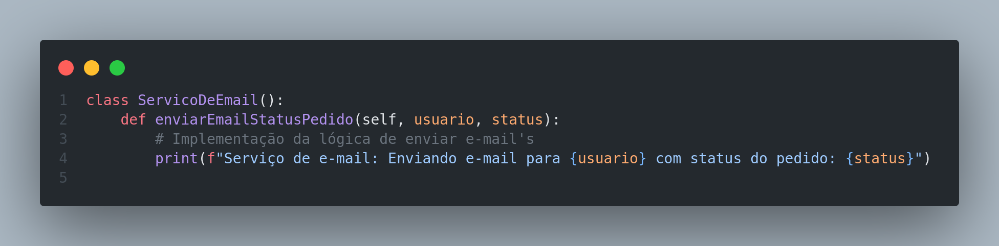

# 4.2. Módulo Reutilização de Software

## Introdução

&emsp;&emsp;Na maioria dos projetos de software, há algum reúso de software. Isso acontece muitas vezes informalmente,
quando as pessoas envolvidas no projeto sabem de projetos ou códigos semelhantes ao que é exigido. Elas os
buscam, fazem as modificações necessárias e incorporam-nos a seus sistemas. Apesar de o reúso ter sido proposto como uma
estratégia de desenvolvimento há mais de 40 anos (McILROY, 1968), só em 2000 o ‘desenvolvimento com reúso’ se tornou
a norma para novos sistemas de negócios. A mudança para o desenvolvimento baseado em reúso foi uma resposta às
exigências de menores custos de produção e manutenção de software, entregas mais rápidas de sistemas e softwares de
maior qualidade. Cada vez mais empresas consideram o software como um ativo valioso. O reúso tem sido promovido
para aumentar o retorno sobre os investimentos em software.(Sommerville, Ian. 2011) Exemplos de unidade de software reutilizaveis:

1. **Reúso de sistema de aplicação.** A totalidade de um sistema de aplicação pode ser reusada sem alterações em outros
sistemas ou pela configuração da aplicação para diferentes clientes. Como alternativa, podem ser desenvolvidas
297Capítulo 16 Reúso de software
famílias de aplicações com uma arquitetura comum, mas adaptadas para clientes específicos. Ainda neste capítulo,
eu trato do reúso de sistemas de aplicação.
2. **Reúso de componentes.** Os componentes de uma aplicação, variando em tamanho desde subsistemas até objetos
únicos, podem ser reusados. Por exemplo, um sistema de identificação de padrões desenvolvido como parte de
um sistema de processamento de textos pode ser reusado em um sistema de gerenciamento de banco de dados.
Trato de reúso de componentes nos capítulos 17 e 19.
3. **Reúso de objetos e funções.** Componentes de software que implementam uma única função, como uma função
matemática ou uma classe de objeto, podem ser reusados. Essa forma de reúso, baseada em bibliotecas-padrão,
tem sido comum nos últimos 40 anos. Muitas bibliotecas de funções e classes estão disponíveis gratuitamente.
Você reusa as classes e funções nessas bibliotecas, ligando-as com o código da aplicação recém-desenvolvido. Essa
é uma abordagem particularmente eficaz em áreas como algoritmos e gráficos matemáticos, em que o conheci-
mento especializado é necessário para o desenvolvimento de funções e objetos eficientes

## Objetivo

&emsp;&emsp; O propósito do artefato em discussão é formular um design arquitetural centrado no reuso de código e componentes para a plataforma das Lojas Americanas. Isso envolve a consideração cuidadosa de conceitos e tecnologias que possam ser aplicados com eficácia para alcançar espeficamente esse objetivo.

## Metodologia

&emsp;&emsp; As propostas de projeto, design e tecnologias apresentadas por este artefato foram discutidas de forma coletiva pelo grupo, com o objetivo de aprofundar a compreensão e aplicar de maneira efetiva os conceitos apresentados nas aulas de arquitetura e reuso de software.

## Desenvolvimento

### Reuso de Conceito

&emsp;&emsp; Os componentes e os sistemas de software são entidades potencialmente reusáveis, mas, algumas vezes, sua natureza
específica significa que é caro modificá-los para uma nova situação. Uma forma complementar de reúso é o ‘reúso
de conceito’, em que, em vez de reusar um componente de software, você reusa uma ideia, uma forma, um trabalho ou
um algoritmo. Pode, portanto, ser configurado e adaptado para uma série de situações. O conceito de
reúso pode ser incorporado em abordagens como <b>padrões de projeto</b>, que é a forma que reuso que foi desendolvida nessa seção.(Sommerville, Ian. 2011)

#### Pedido - Observer/Adapter

&emsp;&emsp; Com base nos pontos apresentados abaixo, escolhemos o padrão Observer, onde você tem a necessidade de notificar Usuario sobre mudanças no status de Pedido e mantém baixo o acoplamento entre essas duas classes.

* **Desacoplamento:**
O padrão Observer é projetado para fornecer um mecanismo de notificação onde objetos (observadores) podem ser informados sobre mudanças em outro objeto (sujeito) sem a necessidade de acoplamento direto entre eles.
Isso é particularmente útil quando você quer garantir que várias partes do sistema possam reagir a mudanças sem conhecerem explicitamente umas às outras.

* **Implementação Flexível:**
O padrão Observer permite uma implementação flexível, onde você pode ter vários observadores interessados nas mudanças de um sujeito. No seu caso, vários Usuario podem estar interessados nas atualizações do Pedido.

* **Reusabilidade:**
O padrão Observer promove a reusabilidade ao permitir que novos observadores sejam adicionados facilmente sem modificar o sujeito.

&emsp;&emsp; Além disso, imaginamos que seria necessário o uso de uma API externa para notificar o usuário através do email, e implementamos um padrão adapter para disponibilizar esse serviço e manter acoplamento baixo aos objetos do nosso sistema.

##### Implementação

  

  

  

  

  

  

  

#### Pagamento - <padrão utilizado>

#### Usuario - <padrão utilizado>

#### Cesta/Produto - <padrão utilizado>

### Reuso Externo

&emsp;&emsp;Fazer o desenvolvimento do artefato. Adicionar, caso necessário, mais tópicos personalizados e relacionados ao seu artefato. 

## Resultado e conclusões

&emsp;&emsp;Discorrer e analisar as conclusões do artefato. A depender, trocar o nome desse tópico para apenas "Conclusão".

## Referências

> * Sommerville, Ian. Engenharia de Software / Ian Sommerville ; tradução Ivan Bosnic e Kalinka G.
>de O. Gonçalves ; revisão técnica Kechi Hirama. — 9. ed. — São Paulo : Pearson
>Prentice Hall, 2011.

##  Histórico de Versão

|  Versão  |   Data da alteração  |   Alteração  |  Responsável  |  Revisor  | Data de revisão |
| :--------: | :--------------------: | :-----------: | :--------------: | :--------: | :-----------------: |
|     1.0     |    30/11/2023   |  Criando documento  |  [Bernardo Pissutti](https://github.com/berssutti)   |   |  |
|     1.1     |    30/11/2023   |  Adição das imagens para o observer e adapter  |  [Bernardo Pissutti](https://github.com/berssutti)   |  Paulo Henrique  | 30/11/2023  |
