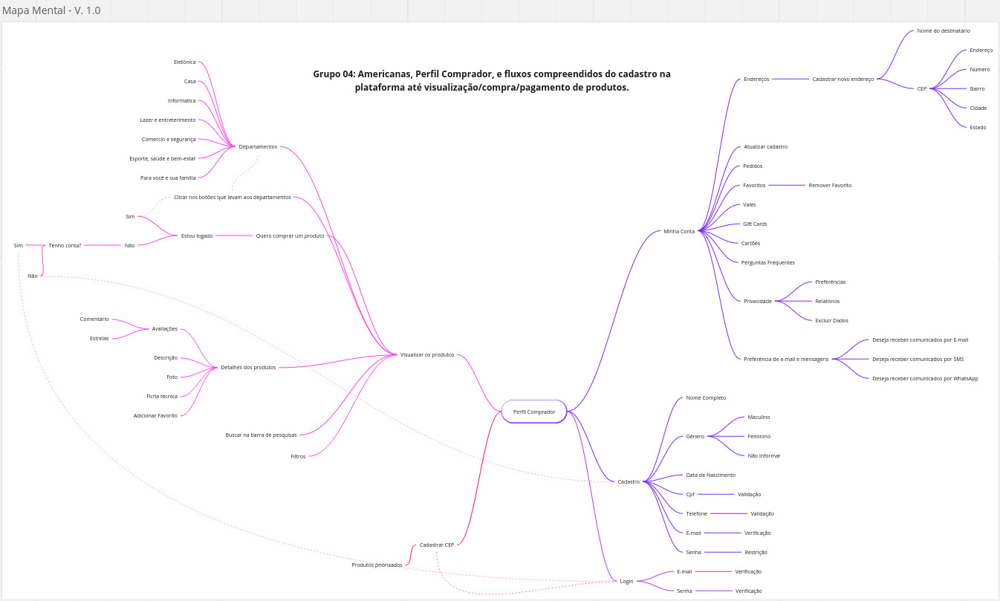

# Mapa Mental

## Introdução

&emsp;&emsp;Quando há muita informação necessária para o abordar um determinado escopo, os mapas mentais surgem como uma solução muito prática para apresentar essas informações de forma mais clara, simples e acessível.

## Objetivo

&emsp;&emsp;A ideía é que, em um curto espaço de tempo e com recursos limitados, uma pessoa seja capaz de criar um sequencia lógica entre os conhecimentos necessários para compreender um determinado assunto.

## Metodologia

&emsp;&emsp;Para criar o mapa mental foi levado em consideração os seguintes detalhes:

1. Definir uma situação problema:
Entender os fluxos de cadastro/visualização/compra/pagamento.

2. Definir em qual perspectiva iriamos analisar o problema:
Analisar sob o ponto de vista de um comprador.

## Participantes

&emsp;&emsp;

| Membros Participantes | Função/Papel |
| :-------------------: | :----------: |
| [Bernardo Pissutti](https://github.com/berssutti) | Criador | 
| [Marcos Felipe](https://github.com/Marofelipe) | Criador |

&emsp;&emsp;**Criador:** O criador é a pessoa que vai analisar o escopo do problema e criar os relacionamentos entre os conhecimentos que ele julgar importante ser destacado no mapa mental.

## Gravação do Mapa Mental

## Resultado

### Versão 1

A primeira versão do mapa mental foi elaborada passo a passo, acompanhando cada etapa do fluxo e registrando os detalhes de cada passo executado. Essa versão foi criada antes da sessão de brainstorming, portanto, estava mais centrada nas etapas e nos raciocínios lógicos necessários para a execução de cada fluxo.

    

### Versão 2 (Final)

Na segunda versão do mapa mental, após um brainstorming para identificar falhas e oportunidades de melhoria nos fluxos do sistema de compras, reestruturamos o artefato, focando nos pontos positivos e negativos de cada fluxo. Essa abordagem visava aprimorar a compreensão e a eficiência do sistema, aproveitando as ideias geradas durante o brainstorm para aprimorar a representação visual dos processos.

Também aprimoramos a organização do artefato visando uma melhor visualização. Na primeira versão, alguns fluxos se sobrepunham, dificultando a compreensão.

    <iframe width="768" height="432" src="https://miro.com/app/embed/uXjVMmo1-cw=/?pres=1&frameId=3458764563923262573&embedId=185343214417" frameborder="0" scrolling="no" allow="fullscreen; clipboard-read; clipboard-write" allowfullscreen></iframe>

## Referências

SERRANO, Milene. "Aula - Projeto e Desenho de Software" .

##  Histórico de Versão

|  Versão  |   Data da alteração  |   Alteração  |  Responsável  |  Revisor  | Data de revisão |
| :--------: | :--------------------: | :-----------: | :--------------: | :--------: | :-----------------: |
|     1.0     |    11/09      |  Introdução, objetivo e metodologia  |  [Bernardo Pissutti](https://github.com/berssutti)   | [Marcos Felipe](https://github.com/marofelipe)   | 14/09 |
|     2.0     |    14/09      |  Versões do artefato  |  [Marcos Felipe](https://github.com/marofelipe)   |    | |