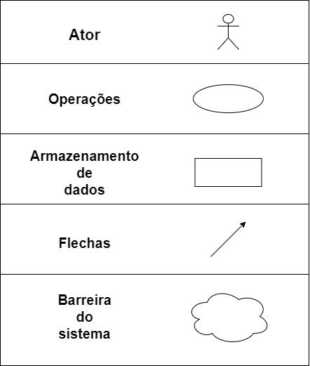
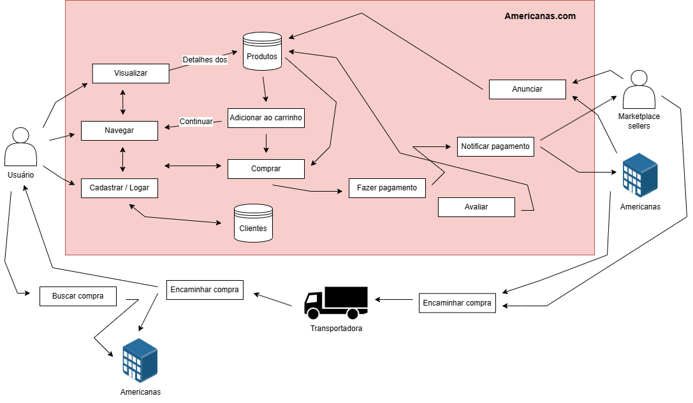
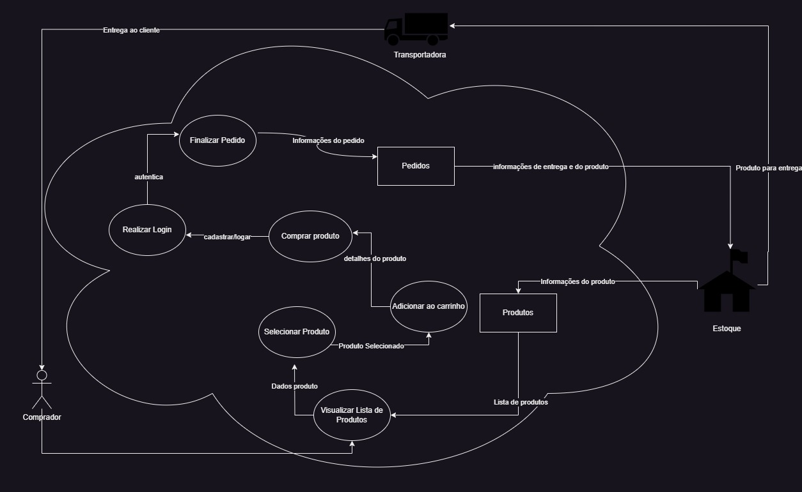
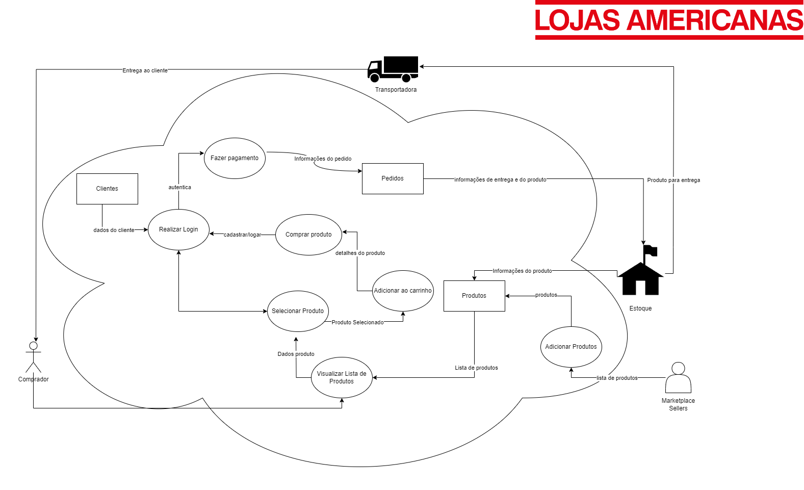

# Rich Picture

## Introdução

&emsp;&emsp; Rich Picture é uma técnica frequentemente empregada na análise de sistemas e na resolução de problemas de natureza complexa. De acordo com Checkland (1999), a Rich Picture é uma representação gráfica que captura visualmente a complexidade de um problema ou situação, permitindo uma compreensão mais profunda e comunicação eficaz entre as partes envolvidas. Além disso, Jackson (1991) enfatiza que o Rich Picture pode ser utilizado como uma poderosa ferramenta de comunicação, facilitando o envolvimento de todas as partes interessadas no processo de análise e resolução de problemas, promovendo assim uma abordagem mais holística e colaborativa.

## Objetivo

&emsp;&emsp;O Artefato em questão tem como objetivo fornecer uma representação visual dos elementos elicitados pelo grupo para ter uma pré-visualização do sistema. Nossa equipe tem como objetivo simplificar a compreensão dos fluxos de cadastro de usuário, visualização, compra e pagamento de produtos na Americanas, proporcionando uma visão abrangente das perspectivas dos membros da equipe. Através dessa colaboração, trabalhamos para alcançar um consenso e criar um modelo final que se baseie nas contribuições iniciais.

## Metodologia

&emsp;&emsp; Para realização do rich picture é necessário a representação de alguns componentes pré-estabelecidos conforme a figura 1. Sendo eles: Atores, Processos, Setas, fronteira e armazenamento de Dados. Os atores representam um grupo de usuários e outros envolvidos ao sistema, como stakeholders e terceiros (ex: fornecedores) podem estar associado a qualquer numero de processos; Processos representam os fluxos presentes no sistemas, ou seja, o que ele faz. Cada processo é executado por um ator ou outro processo; as setas representam o direcionamento dos fluxos e dados armazenados nos processos; Por fim temos a fronteira que delimita o sistema e o mundo externo a ele.

<h4> Figura 1: Componentes do rich picture </h4>

 Fonte: Autoria própria 

 Autor: Paulo Henrique, 2023 

## Desenvolvimento

&emsp;&emsp;Para representar os conceitos abordados pela técnica de rich picture foram elaborados os seguintes diagramas:

<h4 align = "center"> Figura 2: Rich picture do sistema Americanas </h4>

 Fonte: Autoria própria 

 Autor: Paulo Henrique, 2023 

<h4 align = "center"> Figura 3: Rich picture do sistema Americanas </h4>

 Fonte: Autoria própria 

 Autor: Vitor Manoel, 2023 

Obtendo como resultado final o rich picture a seguir:

<h4 align = "center"> Figura 4: Rich picture final do sistema Americanas </h4>

 Fonte: Autoria própria 

 Autores: Paulo Henrique e Vitor Manoel, 2023 

## Resultado e conclusões

&emsp;&emsp;
A utilização de Rich Pictures permite a identificação de problemas de usabilidade em vários sistemas, facilitando aos usuários comunicar visualmente suas experiências e identificar áreas problemáticas. Ao incorporar o feedback do usuário da Rich Pictures em seus processos de design, as empresas podem melhorar a usabilidade do site, contribuindo assim para o aumento da satisfação do cliente e conversões de vendas. Por meio da utilização do artefato, emergiram novas abordagens acerca do funcionamento do sistema, concedendo à equipa de desenvolvimento uma ferramenta de grande potencial que aprimora uma habilidade de gerenciamento, engenharia e compreensão dos requisitos, de acordo com os princípios estabelecidos por esta técnica.

## Referências

> - Jackson, M. C. (2013, June 29). Systems Methodology for the Management Sciences. Springer Science & Business Media.- Checkland, P. (1999, September 28). Systems Thinking, Systems Practice. John Wiley & Sons.
> - Software Development Project. Rich Picture Guideline [CTEC2402]

## Histórico de Versão

| Versão | Data da alteração | Alteração                                                            | Responsável                                                                                        | Revisor | Data de rev |
| ------ | ----------------- | -------------------------------------------------------------------- | -------------------------------------------------------------------------------------------------- | ------- | ----------- |
| 1.0    | 13/09/2023        | Construção do documento                                              | [Paulo Henrique](https://github.com/owhenrique) e [Vitor Manoel](https://github.com/vitormanoel17) |     |             |
| 1.1    | 14/09/2023        | Adição de legenda de rich picture e correção de descrição de figuras | [Paulo Henrique](https://github.com/owhenrique)                                                    |     |             |
