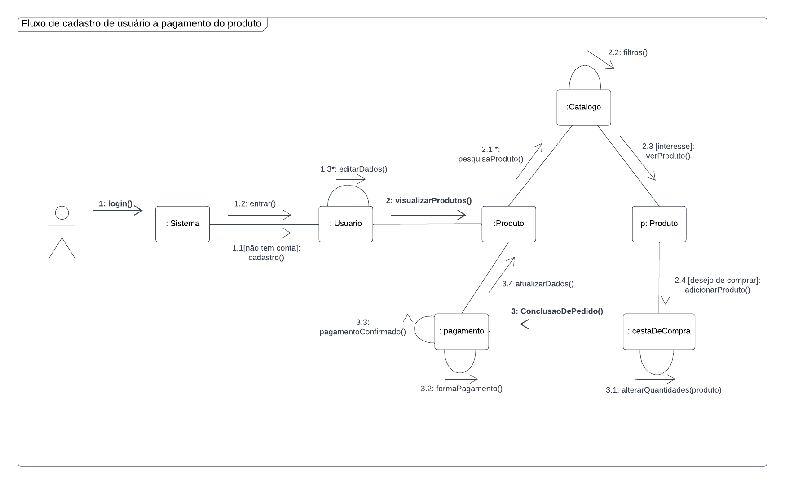

# Diagrama de Colaboração/Comunicação

## Introdução

&emsp;&emsp; Consoante à notação UML para representações de natureza dinâmica, um diagrama de comunicação, também denominado como diagrama de colaboração, 
consubstancia-se como uma tipologia de representação interativa hábil à exploração dos aspectos dinâmicos inerentes a um sistema ou aplicação de software. 
Este diagrama proporciona uma perspectiva alternativa da mesma informação retratada nos diagramas de sequência [1]. No contexto da UML,
o diagrama de comunicação evidencia as interações entre os objetos ou funções por meio de linhas de vida, juntamente com as 
mensagens que fluem entre tais linhas de vida[2].

## Participantes

Os participantes que participaram do desenvolvimento desse artefato foram:

- Bruno Ribeiro
- Bruno Bomfim
- Igor Penha

## Metodologia

Os membros do grupo empreenderam uma ação conjunta para identificar os componentes essenciais no diagrama, incluindo as classes 
pertinentes e as mensagens trocadas entre estas entidades. Adicionalmente, instituiu-se um padrão gráfico uniforme para os diagramas de colaboração, 
assegurando, assim, a coesão visual em todas as instâncias de interação. Ao término deste processo, o diagrama de colaboração tomou forma por 
meio da utilização da ferramenta LucidChart, em um encontro que contou com a participação de diversos membros do grupo.

Visando elaborar um artefato de maior qualidade, também utilizamos as informações de artefatos já realizados pelo grupo anteriormente, foram eles:

- [Rich Picture](https://unbarqdsw2023-2.github.io/2023.2_G4_ProjetoAmericanas/#/Base/richPicture)
- [Diagrama de Classes]()
- [Diagrama de Atividade]()

## Artefato

O artefato desenvolvido em questão foi desenvolvido para auxiliar no entedimento do sistema e das interções entre seus objetos, além de 
fornece uma visão clara das mensagens e do fluxo.

Dessa maneira, com a intenção de analisar o sistema e suas diferentes interações do seu fluxo desde o cadastro até a compra de um produto.
Optamos por separar o fluxo em diferentes interações para facilitar a compreensão e melhorar o trabalho realizado.

## UML - comunicação

O primeiro diagrama de comunicação apresentado representa as interações dinâmicas entre os objetos envolvidos em um processo específico do sistema. Este diagrama oferece uma visão detalhada das trocas de mensagens e das ações realizadas pelos objetos de forma clara e concisa, facilitando a compreensão rápida do processo em questão.

  
  

    <h6 style="text-align: flex;">
    Figura 2 : Diagrama de Comunicação V1 (Fonte: Bruno Ribeiro, Bruno Bomfim e Igor Penha, 2023).
    </h6>
  

  
  

    <h6 style="text-align: flex;">
    Figura 3 : Diagrama de Comunicação V2 (Fonte: Bruno Ribeiro, Bruno Bomfim e Igor Penha, 2023).
    </h6>
  

## Gravação da reunião

A reunião de desenvolvimento do artefato foi gravada no Microsoft Teams e está disponível abaixo: 

<iframe width="1000vw" height="650vh" src="https://www.youtube.com/embed/QJ08eS1TtVs" title="Diagrama de comunicação" frameborder="0" allow="accelerometer; autoplay; clipboard-write; encrypted-media; gyroscope; picture-in-picture" allowfullscreen=""></iframe>

 <b>Vídeo 1</b>: gravação de realização do diagrama de comunicação (Fonte: Grupo. 2023).

## Conclusão

Em resumo, os diagramas de comunicação apresentados neste artefato desempenham um papel crucial na documentação e na compreensão das interações dinâmicas do sistema. Eles foram desenvolvidos de forma colaborativa e seguindo padrões gráficos uniformes para garantir coesão visual.

A gravação da reunião de desenvolvimento do artefato, disponibilizada no vídeo 1, oferece uma visão adicional do processo de criação dos diagramas, permitindo aos membros da equipe revisar as discussões e decisões tomadas durante a elaboração.

Esses diagramas representam uma valiosa contribuição para o projeto, auxiliando na identificação de possíveis melhorias e no entendimento geral do sistema. Eles podem servir como referência para futuras etapas de desenvolvimento e manutenção.

## Referências

- [1] https://www.ibm.com/docs/pt-br/rsm/7.5.0?topic=uml-communication-diagrams;
- [2] https://www.ibm.com/docs/pt-br/radfws/9.6?topic=SSRTLW_9.6.0/com.ibm.xtools.sequence.doc/topics/ccommndiag.htm;
- [3] [UML.org](https://www.uml.org/what-is-uml.htm)
- [4] [Diagramas dinâmicos](https://aprender3.unb.br/pluginfile.php/2482561/mod_label/intro/Arquitetura%20e%20Desenho%20de%20Software%20-%20Aula%20Modelagem%20UML%20Din%C3%A2mica%20-%20Profa.%20Milene.pdf)

## 5. Histórico de Versão

|  Versão  |   Data da alteração  |   Alteração  |  Responsável  |  Revisor  | Data de revisão |
| :------: | :------------------: | :-----------: | :--------------: | :--------: | :-----------------: |
| `1.0` | 26/09/2023 | Criação do artefato de diagrama de comunicação | [Igor Penha](https://github.com/igorpenhaa) | [Lucas Gobbi](https://github.com/lucasbergholz) | 27/09/2023 |
| `1.1` | 05/10/2023 | Adição do diagrama de comunicação | [Igor Penha](https://github.com/igorpenhaa) | [Lucas Gobbi](https://github.com/lucasbergholz) | 05/10/2023 |
| `1.2` | 08/10/2023 | Adição da conclusão e correções finais para a entrega | [Bruno Ribeiro](https://github.com/BrunoRiibeiro) | [Lucas Gobbi](https://github.com/lucasbergholz) | 08/10/2023 |

