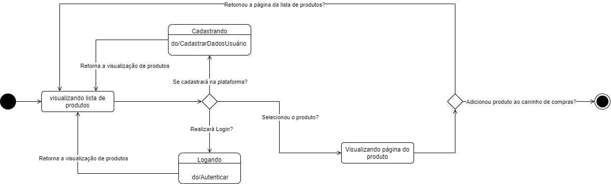

# Diagrama de Estados

## Introdução

&emsp;&emsp; O Diagrama de Estados é uma representação visual poderosa que nos permite compreender e analisar a dinâmica de como nossa plataforma interage com os usuários e responde às diferentes situações e eventos. Este diagrama é uma ferramenta crucial para mapear e otimizar a experiência do usuário, garantindo que nossa plataforma atenda às necessidades e expectativas de forma eficaz. [1]

&emsp;&emsp;Ao longo deste artefato, exploraremos cada estado do fluxo, seus eventos de transição e as ações associadas. Isso nos permitirá obter insights valiosos sobre como os usuários interagem com nossa plataforma, identificar pontos de melhoria e aprimorar continuamente a experiência do usuário.

## Objetivo

 
&emsp;&emsp;O objetivo principal deste documento é fornecer uma visão detalhada e compreensível do Diagrama de Estados do fluxo que compreende o cadastro do usuário, além de, visualização, compra e pagamento de produto dentro da plataforma <a href="https://www.americanas.com.br/">Americanas</a>. Buscamos demonstrar como cada estado se relaciona com as diferentes interações dos usuários, destacar as transições entre esses estados e explicar as ações correspondentes. Importante ressaltar, que os diagramas que serão aqui apresentados derivaram de um Diagrama de Classes desenvolvido pelo grupo 4. 

&emsp;&emsp;Através deste artefato, nosso objetivo é capacitar todos os envolvidos a compreenderem a mecânica envolvida na plataforma estudada, promovendo uma melhor compreensão da experiência do usuário. Além disso, almejamos identificar oportunidades de otimização e aprimoramento, garantindo que o site da <a href="https://www.americanas.com.br/">Americanas</a> atenda as necessidades do usuário.

## Metodologia

&emsp;&emsp;A metodologia utilizada para diagramação dos estados é a UML, tomando base os padrões apresentados nos <a href="https://aprender3.unb.br/pluginfile.php/2649430/mod_label/intro/Arquitetura%20e%20Desenho%20de%20Software%20-%20Aula%20Modelagem%20UML%20Din%C3%A2mica%20-%20Profa.%20Milene.pdf">slides de aula</a> da professora Milene. Tendo em vista que não havia um diagrama de classes do site da Americanas público, foi utilizado o diagrama desenvolvido pelo próprio grupo, <a href="https://unbarqdsw2023-2.github.io/2023.2_G4_ProjetoAmericanas/#/Modelagem/Dinamicos/estados">disponível aqui</a>. A partir deste diagrama de classes, foram identificados dois fluxos para a realização dos diagramas de estados, que são os de usuário e produto.

## Diagramas

&emsp;&emsp;Antes de apresentar os diagramas, é importante que o leitor se atente a legenda presente na Figura 1.

  

<h4 align = "center"> Figura 1: Legenda dos Diagramas de Estados </h4>

 Fonte: Autoria própria 

 Autores:Rafael Bosi, 2023 

&emsp;&emsp;A priori, foram desenvolvidos dois diagramas, um que representa os possíveis estados da classe Produto (Figura 2) e outro que representa a classe Usuário (Figura 3), ambas classes retiradas do <a href="https://unbarqdsw2023-2.github.io/2023.2_G4_ProjetoAmericanas/#/Modelagem/classes.md">diagrama de classes</a> desenvolvido para essa entrega.

<h4 align = "center"> Figura 2: Diagrama de Estados do fluxo de Produto </h4>

 Fonte: Autoria própria 

 Autores: Lucas Gobbi; Rafael Bosi, 2023 

<h4 align = "center"> Figura 3: Diagrama de Estados do fluxo de Usuário </h4>

 Fonte: Autoria própria 

 Autores: Gustavo Barbosa; Paulo Henrique; Vitor Manoel, 2023 

&emsp;&emsp;Após discussões com a professora e a partir do seu feedback, o diagrama de estados que representa o fluxo do usuário foi aprimorado, resultando na Figura 4. Nessa versão alteramos o primeiro estado para a visualização da lista de produtos e também adicionamos descrições das transições dos estados.

<h4 align = "center"> Figura 4: Diagrama de Estados do fluxo de Usuário v2 </h4>

 Fonte: Autoria própria 

 Autores: Gustavo Barbosa; Paulo Henrique; Vitor Manoel, 2023 

&emsp;&emsp;Após conversas com a professora, e avanços em estudos individuais, o diagrama de estados referente ao fluxo do produto foi evoluído para a Figura 5, a qual consta também nela o fluxo referente aos estados da classe Pedido, além de algumas pequenas alterações em nomes de estados, para maior clareza deles.

<h4 align = "center"> Figura 5: Diagrama de Estados do fluxo de Produto e Pedido </h4>

 Fonte: Autoria própria 

 Autores: Lucas Gobbi; Rafael Bosi, 2023 

## Resultado e conclusões

&emsp;&emsp;Ao observar o Diagrama de Estados apresentado na Figura 4, é possível chegar em algumas conclusões sobre o fluxo de Produto dentro da Plataforma Americanas, como o fato de que o fluxo se inicia com o usuário adicionando o produto na cesta de compras, o que deixa claro também que não é possível efetuar a compra de um determinado produto, sem previamente alocá-lo dentro da cesta de compra.

&emsp;&emsp;Além disso, o Diagrama mostra a simplicidade e, ao mesmo tempo, a eficácia do fluxo que deve ser seguido para efetuar uma compra dentro do site analisado. O que é essencial para dar uma boa experiência de compra para o usuário, uma vez que trabalha com seguraça para o sistema e para o cliente e, é claro, fornece uma maior velocidade para as atividades.

## Referências
> - [1] Linguagem de Modelagem Unificada em Português.
> - [2] Serrano, Milene. Slides de Aula. Disponível em: [Link de Acesso](https://aprender3.unb.br/pluginfile.php/2649430/mod_label/intro/Arquitetura%20e%20Desenho%20de%20Software%20-%20Aula%20Modelagem%20UML%20Din%C3%A2mica%20-%20Profa.%20Milene.pdf)

##  Histórico de Versão

|  Versão  |   Data da alteração  |   Alteração  |  Responsável  |  Revisor  | Data de revisão |
| :--------: | :--------------------: | :-----------: | :--------------: | :--------: | :-----------------: |
|     1.0     |    03/10/2023   |  Criando documento  |  [Lucas Gobbi](https://github.com/lucasbergholz)   | [Rafael Bosi](https://github.com/StrangeUnit28)   | 04/10/2023 |
|     1.1     |    05/10/2023   | Ajustando o documento e adicionando legenda e diagrama | [Rafael Bosi](https://github.com/StrangeUnit28) |  [Lucas Gobbi](https://github.com/lucasbergholz) | 07/10/2023 |
|     2.0     |    08/10/2023   | Adicionando diagrama evoluído | [Lucas Gobbi](https://github.com/lucasbergholz)  |  [Rafael Bosi](https://github.com/StrangeUnit28) | 08/10/2023 |
|     2.1     |    09/10/2023   | Adicionando diagrama de usuário aprimorado | [Paulo Henrique](https://github.com/owhenrique) | [Lucas Gobbi](https://github.com/lucasbergholz) | 09/10/2023 |