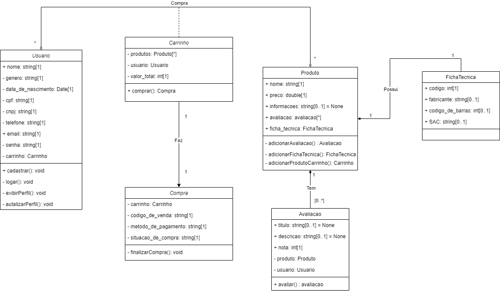
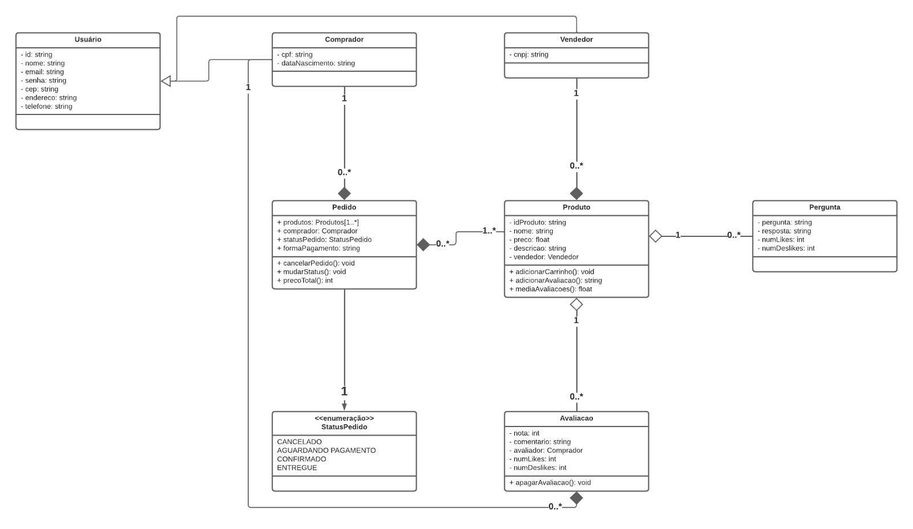
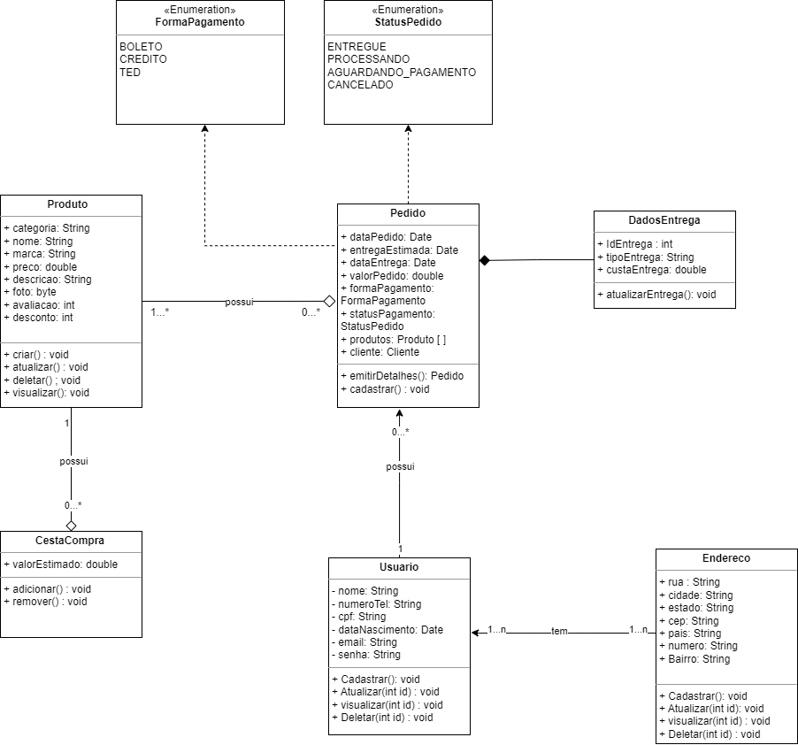
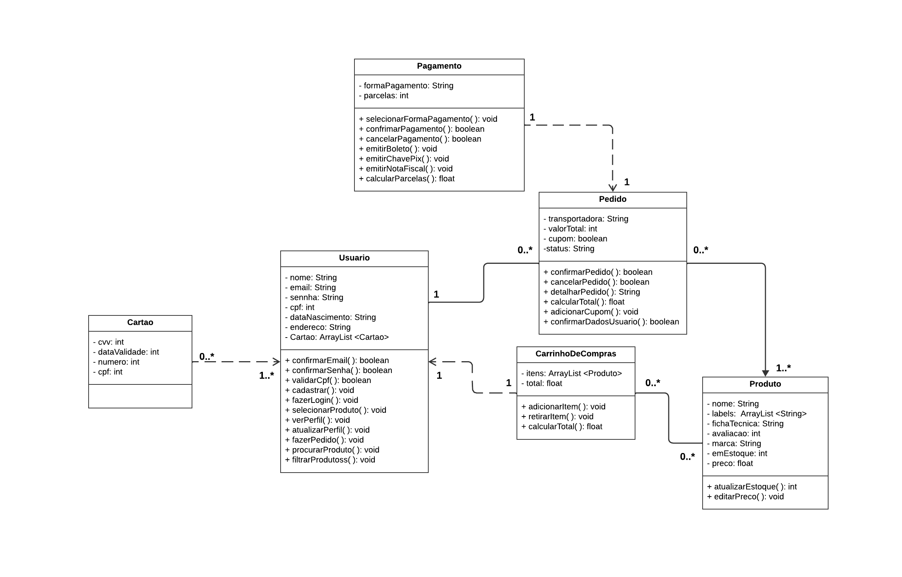
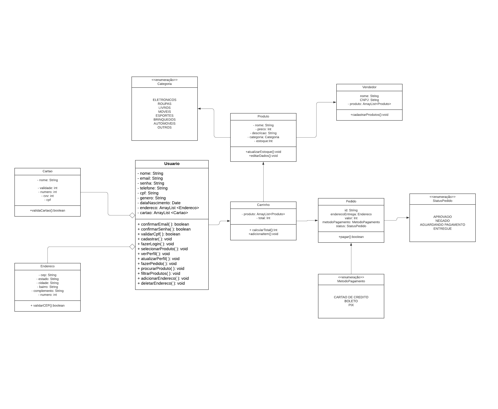
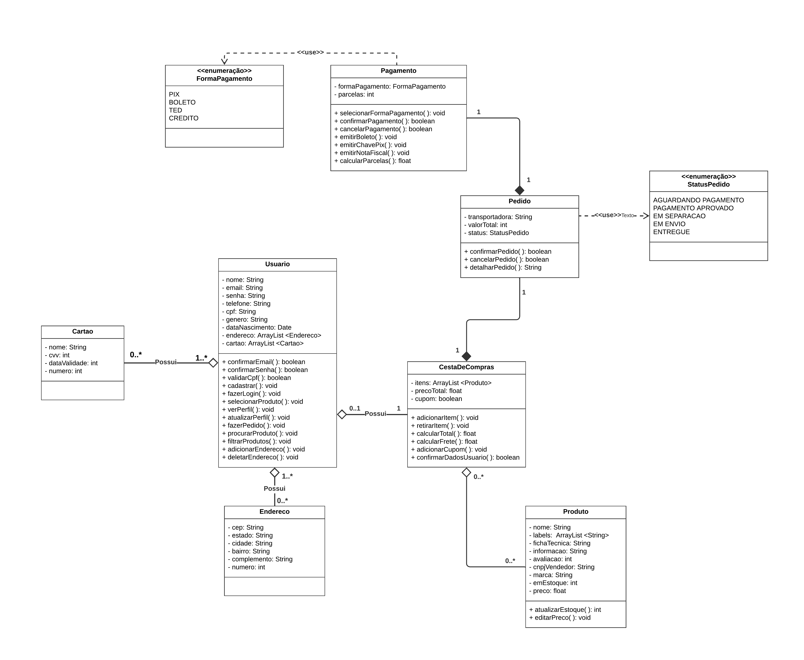

# Diagrama de Classes

## Introdução

&emsp;&emsp;Um diagrama de classes é uma ferramenta fundamental na modelagem de sistemas de software, permitindo a representação visual das classes, seus atributos, métodos e os relacionamentos entre elas. Esses diagramas fazem parte da linguagem de modelagem UML (Unified Modeling Language) e desempenham um papel crucial no processo de desenvolvimento de software. Eles oferecem uma visão abstrata e estruturada do sistema, ajudando os desenvolvedores a compreender a organização das classes e como elas interagem umas com as outras Gogolla & Kobryn (2003). Por meio desses diagramas, é possível documentar a estrutura de um sistema de forma organizada e compreensível, proporcionando uma visão clara das entidades envolvidas e como elas interagem Lucidchart (s.d.).

## Objetivo

&emsp;&emsp;O objetivo do artefato em questão é apresentar os diagramas de classe referente a aplicação web do site da <a href="https://www.americanas.com.br/">Americanas</a> desenvolvidos pelo grupo 4. O diagrama de classes tem como objetivo identificar as classes do sistema analisado, além de seus atributos, métodos e as relações entre suas classes. Este artefato será responsável por clarificar as relações, funções dentre outras questões dos elementos envolvidos no sistema.

## Metodologia

&emsp;&emsp;A metodologia utilizada para diagramação das classes é a UML, tomando base os padrões apresentados nos <a href="https://aprender3.unb.br/pluginfile.php/2649429/mod_label/intro/Arquitetura%20e%20Desenho%20de%20Software%20-%20Aula%20Modelagem%20UML%20Est%C3%A1tica%20-%20Profa.%20Milene.pdf">slides de aula</a> da professora Milene. Posterior ao desenvolvimento de 5 diagramas de classe (um para cada participante deste artefato), foi realizada uma reunião na plataforma <a href="">Microsoft Teams</a> para o desenvolvimento de um diagrama final, tomando base todos os outros. 

## Diagramas

&emsp;&emsp; Neste tópico, apresentaremos os cinco diagramas de classes desenvolvidos por cada membro e o diagrama final para representar a aplicação web do site da Americanas, conforme mencionado no objetivo do artefato. Os diagramas de classes são uma parte essencial da modelagem UML e fornecem uma visão estruturada e abstrata do sistema, identificando classes, atributos, métodos e relacionamentos entre elas.

<h4 align = "center"> Figura 1: Diagrama de classes do sistema Americanas </h4>

 Fonte: Autoria própria 

 Autores: Paulo Henrique, 2023 

<h4 align = "center"> Figura 2: Diagrama de classes do sistema Americanas </h4>

 Fonte: Autoria própria 

 Autores: Lucas Gobbi, 2023 

<h4 align = "center"> Figura 3: Diagrama de classes do sistema Americanas </h4>

 Fonte: Autoria própria 

 Autores: Vitor Brito, 2023 

<h4 align = "center"> Figura 4: Diagrama de classes do sistema Americanas </h4>

 Fonte: Autoria própria 

 Autores: Rafael Bosi, 2023 

<h4 align = "center"> Figura 5: Diagrama de classes do sistema Americanas </h4>

 Fonte: Autoria própria 

 Autores: Gustavo Barbosa, 2023 

<h4 align = "center"> Figura 6: Diagrama de classes final do sistema Americanas </h4>

 Fonte: Autoria própria 

 Autores: Lucas Gobbi; Paulo Henrique; Rafael Bosi; Vitor Brito; Gustavo Barbosa, 2023 

## Gravação da Reunião

&emsp;&emsp;Abaixo se encontra a gravação da reunião de concepção do diagrama final

 
<iframe width="560" height="315" src="https://www.youtube.com/embed/NbPtnir7CRA" title="YouTube video player" frameborder="0" allow="accelerometer; autoplay; clipboard-write; encrypted-media; gyroscope; picture-in-picture; web-share" allowfullscreen></iframe>

Vídeo 1 - Reunião

## Resultado e Conclusões

&emsp;&emsp; Focamos no fluxo do usuário até a compra, proporcionando uma visão direta e clara. Optamos por simplificar a representação das avaliações e integrar como atributos dos produtos em vez de criar uma classe Avaliacao. A utilização de enums facilitou a precisão na modelagem dos atributos. A discussão mais extensa foi em torno do carrinho de compras, resultando na criação de classes dedicadas para o carrinho e seus itens. Definir associações entre as classes foi essencial para capturar as interações do sistema, foi dedicado um tempo considerável debatendo qual era a forma mais condizente de representá-las. Esse diagrama final servirá como uma ferramenta valiosa para entender a estrutura e interações do sistema, facilitando o desenvolvimento e a manutenção do software.

## Referências

> - Gogolla, M., & Kobryn, C. (2003). UML 2001 - The Unified Modeling Language. Modeling Languages, Concepts, and Tools. Springer.
> - O que é um diagrama de classe UML? (s.d.). Lucidchart. Disponível em: https://www.lucidchart.com/pages/pt/o-que-e-diagrama-de-classe-uml;
> - Fakhroutdinov, K. (s.d.). UML Class and Object Diagrams Overview - common types of UML structure diagrams. Disponível em: https://www.uml-diagrams.org/class-diagrams-overview.html;
> - Serrano, Milene. VideoAula - DSW - Modelagem. Diponível em: [Link de acesso](https://unbbr-my.sharepoint.com/personal/mileneserrano_unb_br/_layouts/15/stream.aspx?id=%2Fpersonal%2Fmileneserrano%5Funb%5Fbr%2FDocuments%2FArqDSW%20%2D%20V%C3%ADdeosOriginais%2F05a%20%2D%20VideoAula%20%2D%20DSW%2DModelagem%2Emp4&ga=1);
> - Serrano, Milene. VideoAula - DSW - Modelagem - Diagrama de Classe. Diponível em: [Link de acesso](https://unbbr-my.sharepoint.com/personal/mileneserrano_unb_br/_layouts/15/stream.aspx?id=%2Fpersonal%2Fmileneserrano%5Funb%5Fbr%2FDocuments%2FArqDSW%20%2D%20V%C3%ADdeosOriginais%2F05b%20%2D%20VideoAula%20%2D%20DSW%2DModelagem%20%2D%20Diagrama%20de%20Classe%2Emp4&ga=1);
> - Serrano, Milene. VideoAula - DSW - Modelagem - Dependencia Associacao. Diponível em: [Link de acesso](https://unbbr-my.sharepoint.com/personal/mileneserrano_unb_br/_layouts/15/stream.aspx?id=%2Fpersonal%2Fmileneserrano%5Funb%5Fbr%2FDocuments%2FArqDSW%20%2D%20V%C3%ADdeosOriginais%2F05c%20%2D%20VideoAula%20%2D%20DSW%2DModelagem%20%2D%20Dependencia%20Associacao%2Emp4&ga=1);
> - Serrano, Milene. VideoAula - DSW - Modelagem - Classe Concreta Abstrata Sobrescrita Sobrecarga. Diponível em: [Link de acesso](https://unbbr-my.sharepoint.com/personal/mileneserrano_unb_br/_layouts/15/stream.aspx?id=%2Fpersonal%2Fmileneserrano%5Funb%5Fbr%2FDocuments%2FArqDSW%20%2D%20V%C3%ADdeosOriginais%2F05d%20%2D%20VideoAula%20%2D%20DSW%2DModelagem%20%2D%20Classe%20Concreta%20Abstrata%20Sobrescrita%20Sobrecarga%2Emp4&ga=1);
> - Serrano, Milene. VideoAula - DSW - Modelagem - Agregacao Composicao. Diponível em: [Link de acesso](https://unbbr-my.sharepoint.com/personal/mileneserrano_unb_br/_layouts/15/stream.aspx?id=%2Fpersonal%2Fmileneserrano%5Funb%5Fbr%2FDocuments%2FArqDSW%20%2D%20V%C3%ADdeosOriginais%2F05e%20%2D%20VideoAula%20%2D%20DSW%2DModelagem%20%2D%20Agregacao%20Composicao%2Emp4&ga=1).

## Histórico de Versão

| Versão | Data da alteração |                  Alteração                   |                   Responsável                   |                     Revisor                     | Data de revisão |
| :----: | :---------------: | :------------------------------------------: | :---------------------------------------------: | :---------------------------------------------: | :-------------: |
|  1.0   |    22/09/2023     |              Criando documento               | [Lucas Gobbi](https://github.com/lucasbergholz) | [Paulo Henrique](https://github.com/owhenrique) |   28/09/2023    |
|  1.1   |    28/09/2023     |           Adicionando referências            | [Paulo Henrique](https://github.com/owhenrique) |         [Gustavo](https://github.com/brbsg)          |   28/09/2023    |
|  1.2   |    28/09/2023     | Adicionando diagramas e ajuste de introdução | [Paulo Henrique](https://github.com/owhenrique) |         [Gustavo](https://github.com/brbsg)          |   28/09/2023    |
|  1.3   |    28/09/2023     | Adicionando conclusão e afinamento de documento | [Gustavo](https://github.com/brbsg)  | [Paulo Henrique](https://github.com/owhenrique) |   29/09/2023    |
