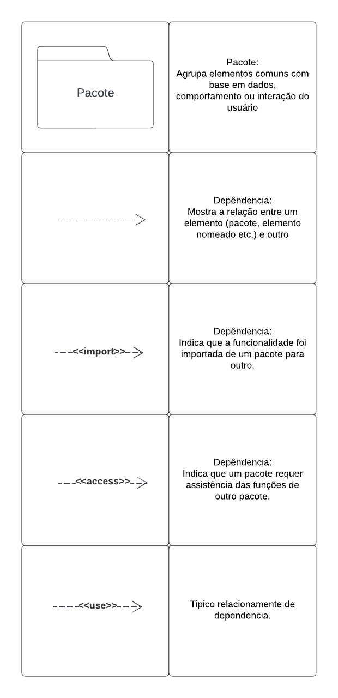

  
# Diagrama de pacotes

## 1. Introdução

&emsp;&emsp; Conforme a notação UML de diagramas estáticos [1], um diagrama de pacotes constitui uma representação estrutural prescrita pela UML, 
cuja finalidade é a descrição dos agrupamentos lógicos que compõem o sistema, destacando, assim, as interdependências existentes entre eles. 
Este tipo de diagrama é frequentemente empregado como meio para representar a estrutura arquitetônica de um sistema, evidenciando a organização de suas classes. 
Cabe mencionar que um pacote, neste contexto, corresponde a uma unidade de agregação que engloba elementos relacionados no âmbito da UML, incluindo, 
mas não se limitando a, diagramas, documentos, classes e, eventualmente, outros pacotes.

## 2. Participantes

Os participantes que participaram do desenvolvimento desse artefato foram:

- Bernado Pissutti
- Bruno Ribeiro
- Bruno Bomfim
- Igor Penha
- Marcos Souza

## 3. Metodologia

O artefato foi desenvolvido em conjunto utilizando a ferramenta Microsoft Teams para reunião e para modelagem a ferramenta LucidChart. 
Para o desenvolvimento em conjunto, um membro do grupo compartilhou a tela da ferramenta de modelagem, e com o auxílio do restante do grupo, 
que também modificava o diagrama online, as ideias e possíveis modelagens foram discutidas. E, assim, foi evoluindo o artefatp ao longo da sprint

## 4. Artefato

&emsp;&emsp;A equipe se reuniu e, juntamente, começou a construir o artefato que seria o diagrama de pacote, inicialmente, a gente tentou modelar quais seriam os tipos de organização de pastas que estaríamos buscando, com uma dica que foi dada pela professora, dividimos em dois grandes modelos principais, Client e Application, o Client é a camada que mostra como o usuário se conecta com a aplicação, no caso, ou por web ou por mobile. Já o módulo Application, foi dividido nos modelos frontend, que continha os pacotes necessários para a criação de telas e manuseio básico de dados, backend, que continha as suas camadas e a conexão externa com o banco de dados, ainda sem modelagem.

### 4.1 Legenda

.
  
  

    <h6 style="text-align: flex;">
    Figura 1 : Legenda do Diagrama de Pacotes
    </h6>
  

### 4.2 Primeira versão do diagrama

  
  

    <h6 style="text-align: flex;">
    Figura 2 : Diagrama de Pacotes V1
    </h6>
  

## 5. Estrutura do diagrama

&emsp;&emsp; A estrtura do diagrama foi dividida em camadas que irão ser explicadas a seguir:

## 6. Gravação da reunião

<iframe width="1000vw" height="650vh" src="https://www.youtube.com/embed/_w_TTuf8hv8" title="reunião de execução do diagrama de pacotes" frameborder="0" allow="accelerometer; autoplay; clipboard-write; encrypted-media; gyroscope; picture-in-picture" allowfullscreen=""></iframe>

 <b>Vídeo 1</b>: gravação da execução do diagrama de pacotes (Fonte: Grupo. 2023).

## 7. Conclusão

## Referências

- [1] https://www.uml-diagrams.org/package-diagrams-overview.html;
- [2] https://react.dev/reference/react

## Histórico de Versão

|  Versão  |   Data da alteração  |   Alteração  |  Responsável  |  Revisor  | Data de revisão |
| :--------: | :--------------------: | :-----------: | :--------------: | :--------: | :-----------------: |
|     1.0     |    25/09/2023   |  Criando documento  |  [Igor Penha](https://github.com/igorpenhaa)   |   |  |
|     2.0     |    29/09/2023   |  Adição de legenda do artefato  |  [Bernardo Pissutti](https://github.com/berssutti)   |   |  |

