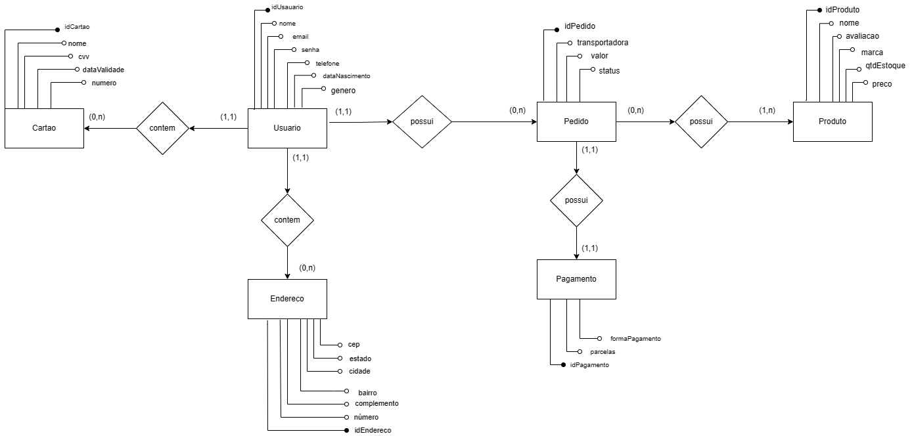

## Visão de Dados

## MER

#### Entidades

* Usuario
* Pedido
* Produto
* Pagamento
* Endereco
* Cartao

#### Atributos

* Usuario: idUsuario, nome, email, senha, telefone, dataNascimento, genero
* Pedido: idPedido, transportadora, valor, status
* Produto: idProduto, nome, avaliacao, marca, qtdEstoque
* Pagamento: idPagamento, parcelas, formaPagamento
* Endereco: idEndereco, numero, complemento, bairro, cidade, estado, cep
Cartao: idCartao, nome, cvv, dataValidade, numero

#### Relacionamentos

**Usuário contém Cartão**
- Um Usuário pode possuir nenhum ou vários cartões (1,n). Um cartão pode ser contido por no mínimo um usuário e no máximo um (1,1);

**Usuário contém Endereço**
- Um usuário pode conter nenhum ou vários endereços  (0,n). Um endereço pode ser contido por no mínimo um usuário, e no máximo um.

**Usuário possui Pedido**
- Um Usuário pode possuir nenhum ou vários pedido(0,n). Um Pedido pode ser possuido por no minimo um Usuário, e no máximo um (1,1);

**Pedido possui Pagamento**
- Um Pedido pode possuir no mínimo um pagamento, e no máximo um (1,1). Um pagamento pode ser possuido por  no mínimo um pedido, e no máximo um (1,1);

**Pedido possui Produto**

- Um pedido possui no minimo um Produto ou vários Produtos (1,n). Um Produto pode ser possuido por nenhum ou vários pedidos (0,n).

## DER

 Diagrama Entidade-Relacionamento (Elaborado por: Vitor Manoel & Gustavo Barbosa. 2023).

