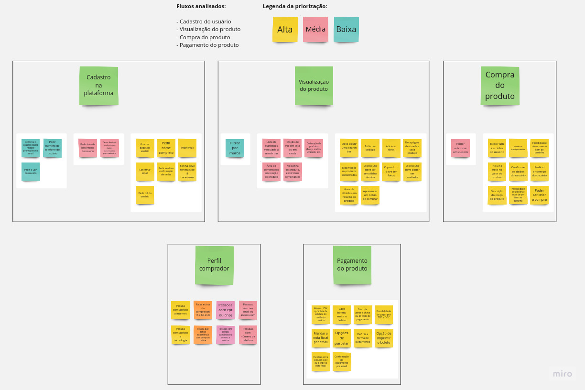
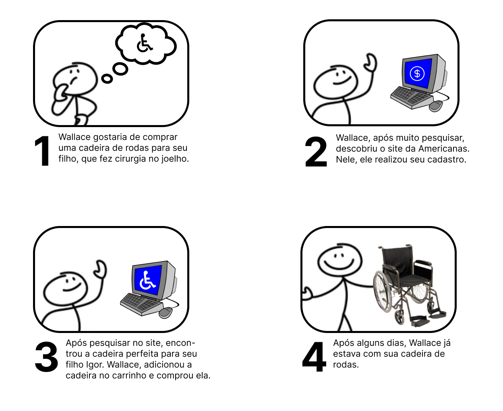
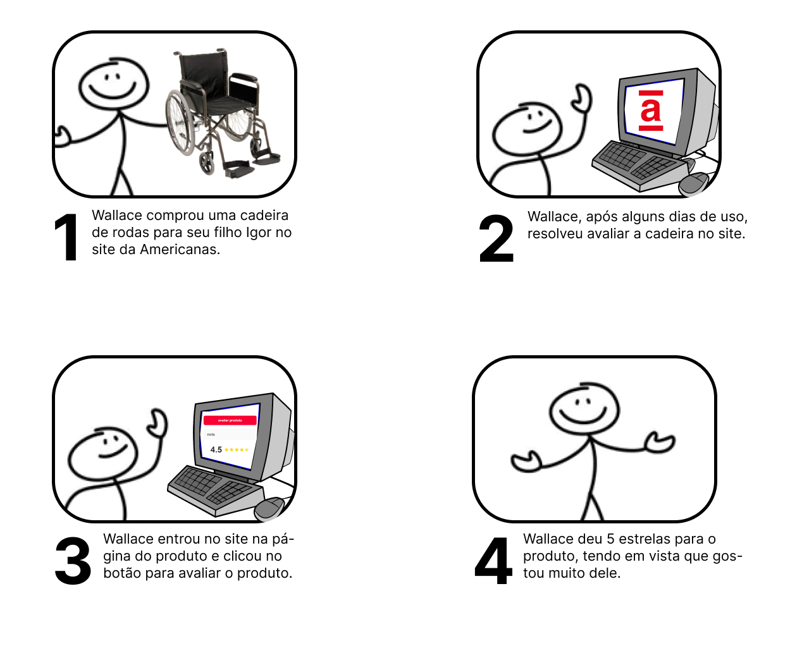
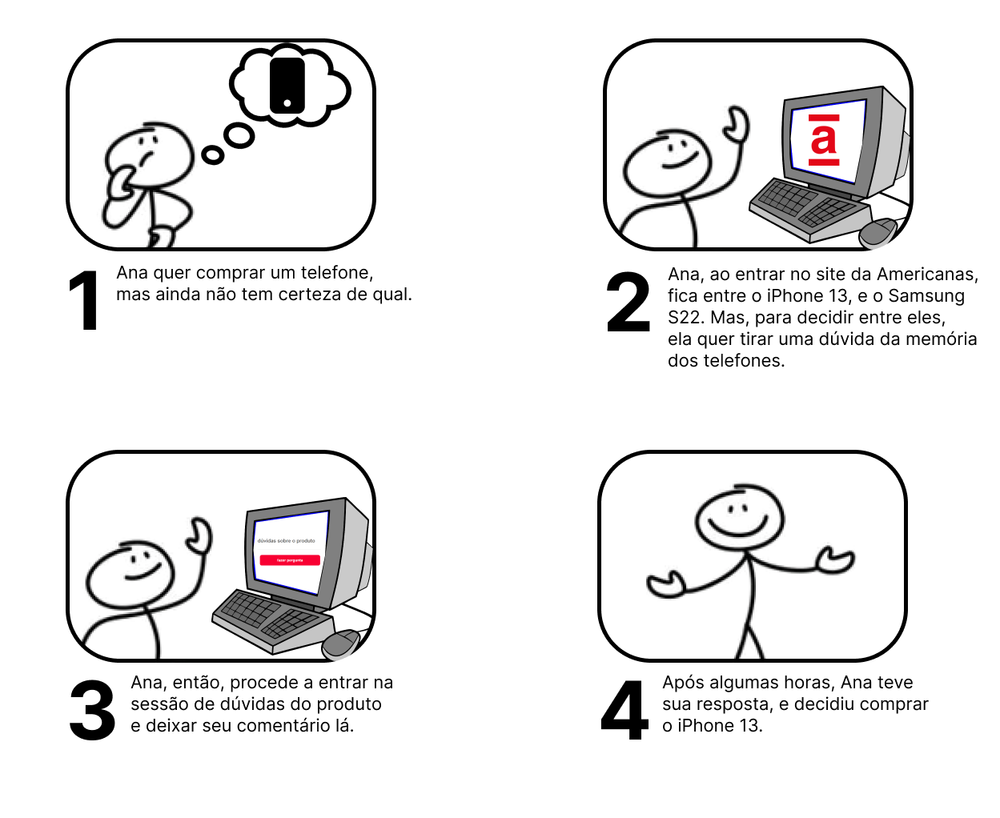

# 2023.2_G4_ProjetoAmericanas

**Código da Disciplina**: FGA0208 
**Número do Grupo**: 04 

## Alunos
| Foto | Matrícula | Nome | Github |
|---|---|---|---|
|  | 19/0103302 | Bernardo Chaves Pissutti | [berssutti](https://github.com/berssutti) |
|  | 21/1039288 | Bruno Campos Ribeiro | [BrunoRiibeiro](https://github.com/BrunoRiibeiro) |
|  | 21/1039297 | Bruno Martins Valério Bomfim | [gitbmvb](https://github.com/gitbmvb) |
|  | 18/0042041 | Gustavo Barbosa de Oliveira | [brbsg](https://github.com/brbsg) |
|  | 21/1029352 | Igor E Silva Penha | [igorpenhaa](https://github.com/igorpenhaa) |
|  | 21/1029441 | Lucas Gobbi Bergholz | [LucasBergholz](https://github.com/LucasBergholz) |
|  | 18/0066382 | Marcos Felipe de Almeida Souza | [marofelipe](https://github.com/marofelipe) |
|  | 17/0020291 | Paulo Henrique Almeida da Silva | [owhenrique](https://github.com/owhenrique) |
|  | 21/1029559 | Rafael Brito Bosi Rodrigues | [StrangeUnit28](https://github.com/StrangeUnit28) |
|  | 20/0028677 | Vitor Manoel Aquino de Brito | [vitormanoel17](https://github.com/vitormanoel17) |

## Sobre

A [Americanas.com](https://www.americanas.com.br/) é uma plataforma online para compra e venda de produtos de grande variedade, como eletrônicos, eletrodomésticos, livros, entre outros. A plataforma é uma das maiores do Brasil, e conta com um grande número de usuários e vendedores.

O objetivo deste projeto é desenvolver, com vistas educacionais, um projeto de arquitetura de software para a Americanas, compreendendo os fluxos de perfil comprador, cadastro na plataforma até visualização/compra/pagamento de produtos.

## Screenshots Primeira Entrega <<FOCO: DSW(Base)>>
<!-- Adicione 2 ou mais screenshots em termos de artefatos da Primeira Entrega. -->

### Brainstorming 

### Storyboards

<!-- ### Rich pictures

 -->

<!-- ## Screenshots Segunda Entrega <<FOCO: DSW(Modelagem)>>
Adicione 2 ou mais screenshots em termos de artefatos da Segunda Entrega.

## <<FOCO: DSW(Padrões de Projeto)>>
Esse módulo/tópico será avaliado via Prova.
Portanto, sem necessidade de Screenshots.

## Screenshots Terceira Entrega (FINAL) <<FOCOS: Arquitetura & Reutilização de Software & PROJETO FINAL>>
Adicione 2 ou mais screenshots em termos de artefatos da Quarta Entrega. -->

<!-- ## Descritivo dos Principais Aspectos Técnicos 
**Principal(is) Metodologia(s) Adotada(s)**: xxxxxx 
**Principais Linguagens Utilizadas e/ou Pretendidas**: xxxxxx 
**Principais Tecnologias Utilizadas e/ou Pretendidas**: xxxxxx 
**Principal(is) Estilo(s) Arquitetural(is) Adotado(s)**: xxxxxx  -->

<!-- ## Há algo a ser executado?

( ) SIM

( ) NÃO

Se SIM, insira um manual (ou um script) para auxiliar ainda mais os interessados na execução.

## Informações Complementares 
Quaisquer outras informações adicionais podem ser descritas nessa seção. -->

## Histórico de Versão
|  Versão  | Data da alteração | Alteração | Responsável | Revisor | Data de revisão |
| :---: | :---: | :---: | :---: | :---: | :---: |
| 1.0 | 05/09 | Criação do documento | [Bruno Martins](https://github.com/gitbmvb) | [Lucas Gobbi](https://github.com/LucasBergholz) | 06/09 |
